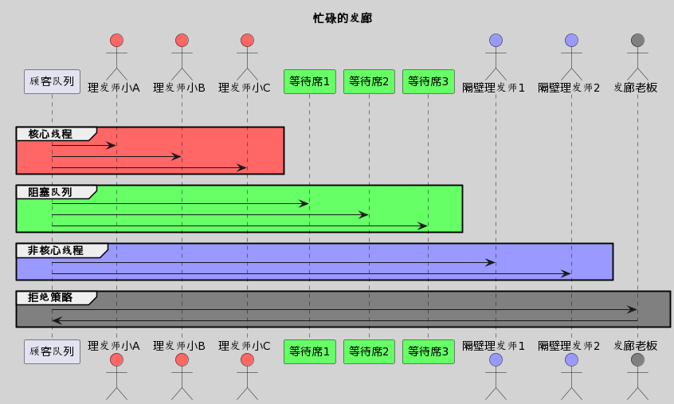

# 线程池工作原理

## 概述

线程池的工作原理如下所示：
1. 初始化：创建一定数量的线程并准备任务队列。
2. 任务提交：当有任务提交时，线程池会选择一个空闲线程来执行任务。
3. 线程执行：选中的线程执行任务，处理完后继续从任务队列获取下一个任务执行。
4. 任务队列管理：如果没有空闲线程，任务会被加入任务队列等待执行。
5. 并发控制：线程池根据配置的参数控制并发线程数量和任务队列长度。
6. 线程重用：执行完任务的线程可以被重用，避免频繁创建和销毁线程。
7. 关闭：线程池关闭时，不再接受新的任务，并且等待执行的任务会被处理完毕。
通过这些步骤，线程池可以高效地管理和调度线程，提高任务处理的效率和性能。

## 详述

Java的线程池主要由`ThreadPoolExecutor`类来实现。理解线程池的工作原理有助于我们更加合理地使用它来处理并发任务。下面概述了线程池的工作原理及其主要组成部分：

### 线程池的工作原理

1. **任务提交**：
   当一个任务（通常是一个实现了`Runnable`接口或`Callable`接口的对象）被提交到线程池后，线程池的处理流程通常如下：

2. **判断核心线程池是否满**：
   - 若核心线程池没有满，则创建新的工作线程来执行任务。
   - 若核心线程池满了，则将任务放入工作队列（work queue）中。

3. **工作队列判断**：
   - 若工作队列未满，新提交的任务会被加入到这个队列中等待执行。
   - 若工作队列满了，则根据最大线程池大小（`maximumPoolSize`）来判断是否需要创建新的线程来执行任务。

4. **判断最大线程池大小**：
   - 若当前线程池的大小还未达到最大线程池大小，则创建新的工作线程来执行任务。
   - 若已达到最大线程池大小，则根据你设定的拒绝策略（`RejectedExecutionHandler`）来处理这个任务。

5. **任务执行**：
   线程池中的线程会循环的从工作队列中取出任务来执行。

6. **线程池回收**：
   当线程池中的线程数量超过核心线程数，并且线程的空闲时间超过你设定的`keepAliveTime`时，这些空闲线程会被终止，以释放系统资源。

### 线程池的组成部分

- **核心线程（Core Pool）**：线程池中始终存活的线程数。
  
- **工作队列**：用于存储待执行的任务的阻塞队列。

- **最大线程数**：线程池中允许的最大线程数。当工作队列满了，并且核心线程都在工作时，线程池会创建新的线程，直到达到最大线程数。

- **空闲线程的存活时间**：当线程池中线程数量超过核心线程数量时，多余的空闲线程存活的最长时间。

- **线程工厂**：用于创建新线程的工厂。

- **拒绝策略**：当线程池及工作队列都满了，无法处理更多任务时的策略。

### 示例代码

这是一个`ThreadPoolExecutor`的简单使用示例，用于说明其工作机制的部分参数：

```java
import java.util.concurrent.*;

public class ThreadPoolExample {
    public static void main(String[] args) {
        ThreadPoolExecutor executor = new ThreadPoolExecutor(
            2,                      // corePoolSize
            4,                      // maximumPoolSize
            60L,                    // keepAliveTime
            TimeUnit.SECONDS,        // timeUnit
            new LinkedBlockingQueue<>(2) // workQueue
        );
        
        // 提交任务到线程池
        executor.execute(new Runnable() {
            @Override
            public void run() {
                // 执行任务
            }
        });
        
        // 关闭线程池
        executor.shutdown();
    }
}
```

了解线程池的工作原理以及每个参数的含义，有助于在实际工作中更加合理有效地使用线程池，提高系统性能并减少系统负载。

## 小剧场-忙碌的发廊
### 角色名单
``` text
任务：需要理发的顾客

线程池：发廊

线程：理发师，
   1. 核心线程：正式理发师
   2. 非核心线程：向其它理发店临时借用来的理发师，用完就还回去

阻塞队列：等待席。

最大线程数：正式理发师+临时理发师的数量。
```
### 剧情



```
A发廊有3位理发师，等待席上有3个座位。
理发师小A和小B正在招待2位顾客。
一位顾客进来理发，理发师小C起身为他服务（创建核心线程执行任务）。
又有3位顾客进来理发，他们坐在等待席上等待理发（加入等待队列）。
又有2位顾客进来理发，此时理发师都在忙，等待席也坐满了人。
发廊老板于是赶紧向其它理发店借来了两位理发师，来为他们服务（创建非核心线程执行任务）。
结果过了一分钟，又有顾客来了，发廊老板只能拒绝为他服务（执行拒绝策略）。 
```

<br>

## 记忆助手
1. 结合线程池的三个构造参数（核心线程数，工作队列，最大线程数）来记忆三个判断条件。
   1. 核心线程数不满的话，就创建核心线程来执行。
   2. 等待队列不满的话，就先加入等待队列，等待核心线程来执行。
   3. 最大线程数不满的话，就创建非核心线程来执行。
2. 线程池最后一个构造参数也是流程的最后一步。
3. 创建非核心线程的两个必要条件
   1. 最大线程数大于核心线程数。
   2. 核心线程池和阻塞队列都满了。