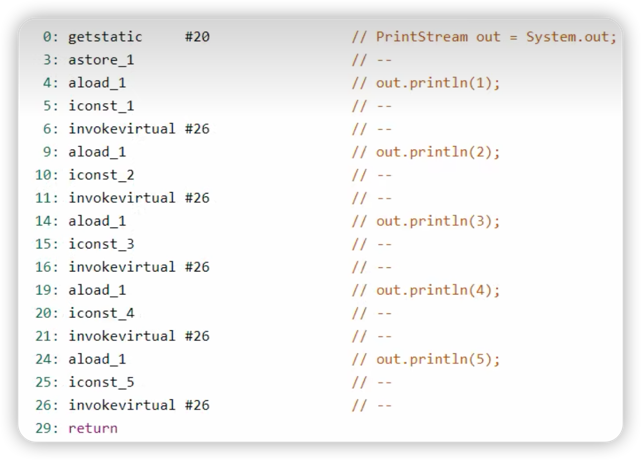

# 程序计数器

## 概述
当前线程所执行的 **字节码** 的 **行号指示器** 。

### 作用
记录正在执行的JVM字节指令地址。

左侧：二进制字节码，经过解释器处理后变为机器码。

右侧：对应的Java代码。

### 特点
1. 线程私有（公有的是堆区和方法区）。
2. 不会发生OOM。

## 详述

程序计数器（Program Counter Register）是Java虚拟机（JVM）的一部分，是线程私有的数据区域，它有些时候也被称为指令计数器或者指令指针。程序计数器在JVM架构中扮演着非常基础但至关重要的角色。

### 主要功能：

1. **存储下一条指令的地址**：程序计数器主要用来存储正在执行的Java虚拟机字节码指令的地址。在JVM的多线程环境下，每个线程都有自己的程序计数器，记录着该线程当前正在执行的字节码指令的地址。

2. **支持线程切换**：当线程执行权被切换时，程序计数器记录着当前线程的执行位置，这样当线程重新获得执行权的时候，能够知道应该从哪里开始执行。

### 特性：

- **线程私有**：每个线程在创建的时候都会创建一个程序计数器，线程的字节码指令地址会存储在这个线程自己的程序计数器中，各个线程之间的程序计数器互不影响。

- **唯一一个不会出现`OutOfMemoryError`的区域**：如果线程执行的是一个Java方法，这个计数器记录的是正在执行的虚拟机字节码指令的地址；如果正在执行的是Native方法，则这个计数器的值为空（Undefined）。

### 作用与重要性：

1. **保证线程切换的正确性**：在多线程执行的环境下，CPU需要不断地切换各个线程的执行，程序计数器帮助恢复到正确的执行位置。

2. **字节码解释执行**：通过改变程序计数器的值来获取下一条需要执行的字节码指令。

3. **支持异常处理**：当发生异常时，通过程序计数器记录的当前指令地址，JVM能够找到方法的异常处理表，进而定位到异常处理代码的位置。

4. **支持分支指令**：通过改变程序计数器的值来实现代码的多路分支。

5. **支持循环、跳转和条件判断等逻辑**：程序计数器的值根据逻辑指令的结果进行修改，实现这些逻辑控制。

理解程序计数器的工作原理和用途，对于分析JVM的运行、解析线程的状态和数据、调试多线程问题等方面都具有一定的帮助。