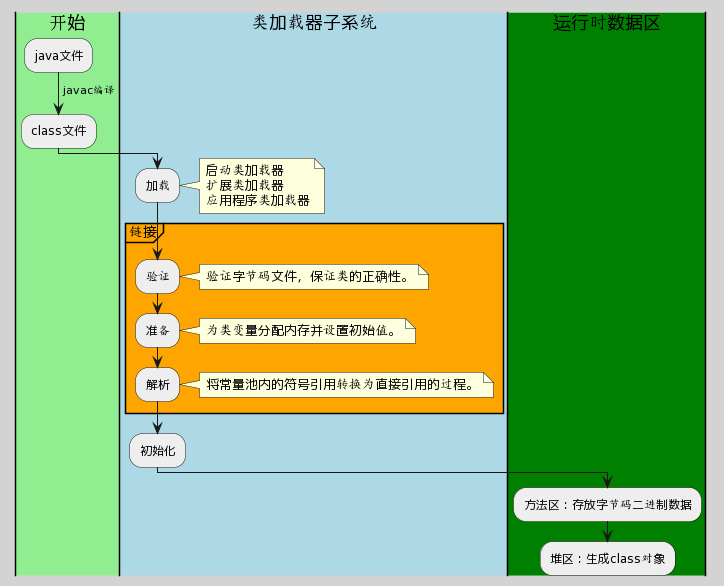

# 类的加载

## 概述

Java类加载机制的步骤如下：
1. 加载：通过类加载器将类的字节码文件加载到内存中。
2. 验证：验证字节码的合法性，检查结构、安全性等方面的问题。
3. 准备：为类的静态变量分配内存并设置默认初始值。
4. 解析：将符号引用转换为直接引用，建立对其他类的引用关系。
5. 初始化：执行类的初始化代码，包括静态变量赋值和静态代码块的执行。
6. 使用：通过类的实例化或调用静态方法等方式使用类。
7. 卸载：当类不再使用时，由垃圾回收器卸载类并释放相关资源。

这些步骤按照顺序执行，确保类的正确加载和初始化，并提供对类的使用和卸载的支持。

## 详述

Java类加载机制是Java语言设计时的一项创新，它降低了运行时环境与硬件的耦合度，提高了代码的可移植性。类加载机制负责将`.class`文件中的类的二进制数据读取到内存中，存放在运行时数据区的方法区内，同时JVM会在堆中创建一个java.lang.Class对象，用来封装在方法区内的数据结构。

Java的类加载过程通常包括以下几个步骤：

### 1. 加载（Loading）

- **动作**：由类加载器完成，读入类的二进制数据，并存放到方法区。
  
- **产出**：在堆区创建一个`java.lang.Class`对象，代表这个类。

### 2. 验证（Verification）

- **目的**：确保`.class`文件的字节流中包含的信息符合当前虚拟机要求，没有安全问题。

- **内容**：主要包括文件格式验证、元数据验证、字节码验证、符号引用验证等。

### 3. 准备（Preparation）

- **目的**：为类的静态字段分配内存，并设置默认初始值。

- **注意**：这些内存都将在方法区中进行分配。

### 4. 解析（Resolution）

- **动作**：将常量池内的符号引用转换为直接引用。符号引用就是一组符号来描述目标，可以是任何字面量。直接引用就是直接指向目标的指针、相对偏移量或者是一个能直接定位到目标的句柄。

### 5. 初始化（Initialization）

- **动作**：执行类的初始化语句，包括静态变量和静态代码块。

- **过程**：按照代码从上到下的顺序执行。

### 类加载器（Class Loaders）

- **启动类加载器（Bootstrap ClassLoader）**：负责加载JVM基础核心类库（位于`<JAVA_HOME>/jre/lib/rt.jar`），是用C/C++实现的。

- **扩展类加载器（Extension ClassLoader）**：负责加载Java的扩展库（位于`<JAVA_HOME>/jre/lib/ext/*.jar`）。

- **应用类加载器（Application ClassLoader）**：负责加载用户路径（ClassPath）上的类库。

- **自定义类加载器**：Java允许用户自定义类加载器，继承`java.lang.ClassLoader`类，并重写`findClass`方法。

### 双亲委派模型（Parent Delegation Model）

- **工作原理**：如果一个类加载器收到了类加载请求，它首先不会自己去尝试加载这个类，而是把这个请求委派给父类加载器去完成，每一个层次的类加载器都是如此，因此所有的加载请求最终都应该传送到顶层的启动类加载器中。

- **好处**：避免类的重复加载；保护关键的Java核心API不被修改。

- **自定义类加载器**：可以通过打破双亲委派模型来实现一些特殊需求。

理解Java的类加载机制，尤其是类加载过程和双亲委派模型，对于分析和解决Java运行时的各种ClassNotFound、ClassDefNotFound等相关问题具有非常重要的意义。

