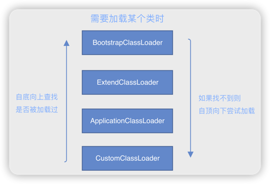

# 双亲委派

## 快速理解

双亲委派机制是指类加载器在加载类时，先将加载请求委派给父类加载器，直到顶层加载器，确保类的唯一性和安全性。

> 🤔 如果自定义了一个java.lang.String的类，是否会被加载？
> > 不会，因为系统的java.lang.String类会被BootstrapClassLoader首先加载

1. BootstrapClassLoader：启动类加载器，用来加载JAVA_HOME/lib/下的jar包
2. ExtensionClassLoader：扩展类加载器，用来加载JAVA_HOME/lib/ext/下的jar包
3. ApplicationClassLoader：应用类加载器，用来加载CLASSPATH下的jar包
4. CustomClassLoader：自定义类加载器

### 优点
1. 避免类被重复加载。
2. 避免恶意类的加载。
3. 类被尽可能加载。

## 详述

**双亲委派机制**（Parent Delegation Model）是Java类加载器（ClassLoader）在加载类时所遵循的一种设计原则。这种机制能够确保一个类在Java虚拟机（JVM）中只会被加载一次。下面将详细地描述双亲委派机制的工作原理和其存在的意义。

### 工作原理

1. **接收加载指令**：当一个类加载器（ClassLoader）接收到类加载的请求时，它并不会尝试立即去加载这个类。

2. **委派给父加载器**：而是将这个请求委派给父类加载器。

3. **递归委派**：父类加载器也同样不会立即加载这个类，而是继续委派给更上层的父类加载器。

4. **尝试加载**：这样递归往上委派，直到启动类加载器（Bootstrap ClassLoader）。启动类加载器尝试找到并加载这个类，如果找到，就结束加载；如果没找到，委派给发起委派的父加载器。

5. **返回结果**：父加载器如果能加载这个类则加载，如果不能，则委派给子加载器。依此类推，直到返回给最初尝试加载该类的加载器，并由其完成类的加载。

### 简化的流程

- 一个类加载器收到类加载请求。
- 将这个请求向上委派给父类加载器去完成。
- 一直向上委派，直到启动类加载器。
- 启动类加载器检查是否能够加载当前这个类。能加载就使用当前的加载器，否则，把类加载任务传递给子加载器去完成。
- 依次迭代，尽可能寻找能够加载当前类的类加载器来加载这个类。

### 存在的意义

1. **避免类的重复加载**：由于在向上委派过程中，启动类加载器位于最上层，可以最大程度地确保所有加载的类不会被重复加载。

2. **保护程序安全**：可以确保一些核心的、不希望被外部修改的Java类（例如`java.lang.String`、`java.lang.Object`等）不会被修改和篡改。

3. **维护类的加载顺序**：保证基础类的优先加载，有利于系统的稳定运行。

双亲委派机制是Java类加载的一个基石，理解其工作原理有助于在面对一些复杂的类加载问题（如版本冲突、类找不到等）时，能够迅速定位问题所在并找到解决方案。