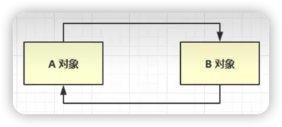

# 怎么判断对象是否可以被回收

# 引用计数器法

引用计数法是一种垃圾回收算法，通过记录每个对象被引用的次数，当引用计数为0时，表示对象不再被引用，可以被回收。

## 详述

引用计数法是一种垃圾收集算法，用于确定哪些对象是不再被需要或不可达的，从而可以被安全地回收。该算法主要依赖于为对象引用计数的基本原理：每当有一个引用指向一个对象时，对象的引用计数加1；每当一个引用停止指向对象时，对象的引用计数减1。以下是引用计数法在垃圾收集（Garbage Collection）中的基本工作流程和特点：

### 工作流程

1. **计数增减**：
   - 当一个对象被引用时，其引用计数加1。
   - 当一个引用被废弃或重新指向时，原先指向的对象引用计数减1。

2. **回收判断**：
   - 一个对象的引用计数降为0时，意味着没有任何引用指向这个对象，该对象变成不可达状态。
   - 对象变成不可达后，可以被视为垃圾，并由垃圾收集器回收。

3. **内存回收**：
   - 垃圾收集器找到引用计数为0的对象。
   - 回收这些对象占用的内存空间。

### 特点

1. **实时性**：引用计数法可以立即回收不再使用的对象，不需要等待特定的垃圾回收周期。

2. **简单直观**：引用计数法的算法和实现相对简单直观，容易理解。

### 问题

1. **循环引用问题**：
  
   引用计数法无法处理循环引用的情况。例如，如果对象A和B相互引用，即使没有其他引用指向它们，它们的引用计数也永远不会降到0，因此无法被回收，导致内存泄露。

2. **性能开销**：
   维护引用计数带来一定的性能开销。因为每次引用关系改变时，都需要更新对象的引用计数。

3. **内存开销**：
   每个对象都需要额外的空间来存储引用计数，这在内存使用上是一种开销。

尽管引用计数法在处理某些场景（如实时性要求较高的系统）中有其优势，但由于上述问题，该方法并不是主流的JVM垃圾收集策略。在Java虚拟机中，主要采用的是`分代收集`（Generational Collection）算法。
   