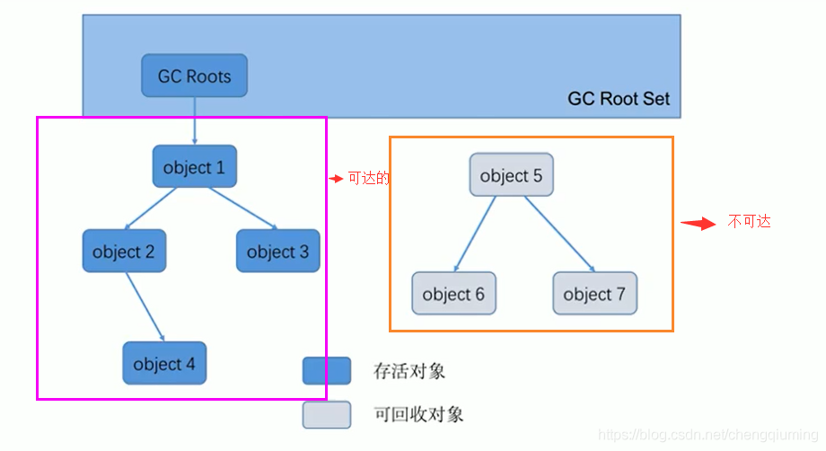

# 可达性分析法

## 概述

可达性分析法是一种垃圾回收算法，通过判断对象是否可被程序中的根对象直接或间接引用来确定对象是否可达，不可达的对象将被标记为垃圾并进行回收。

1. 从 GC Roots 开始向下搜索，搜索所走过的路径称为引用链。
2. 当一个对象到 GC Roots 没有任何引用链相连时，则证明此对象是可以被回收的。

### GC Roots可以是哪些？
堆空间外的一些结构，比如虚拟机栈、本地方法栈、方法区、字符串常量池等地方对堆空间进行引用的，都可以作为 GC Roots 进行可达性分析。

## 详述

**可达性分析法**（Reachability Analysis）是Java虚拟机（JVM）中的一种主要的垃圾收集策略。这种策略的核心思想是通过一系列的称为"GC Roots"的对象作为起始点，从这些节点开始，通过引用关系遍历，可以到达的对象都被认为是还在使用的对象；而那些与GC Roots节点不连通的对象则视为不可达的，因此可以判定它们是可以被安全回收的垃圾对象。

### **GC Roots对象通常包括以下几种：**

1. **虚拟机栈（Stack Frames）中引用的对象**：局部变量表中引用的对象。

2. **方法区中类静态属性引用的对象**：例如Java类的`static`变量。

3. **方法区中常量引用的对象**：例如字符串常量池（String Constant Pool）和常量池中的常量。

4. **本地方法栈中JNI（即通常说的Native方法）引用的对象**。

5. **所有被同步锁（synchronized关键字）锁住的对象**。

6. **Java虚拟机内部的引用**：如基本数据类型的Class对象，一些常驻的异常对象等。

7. **反映Java虚拟机内部情况的JMX Bean、JVMTI中注册的回调、本地代码缓存等**。

### **工作流程**

1. **标记阶段**：通过从GC Roots出发遍历引用链，标记出所有在工作内存中可达的对象。

2. **回收阶段**：对于那些在标记阶段中没有被标记的对象，将它们的存储空间回收。

### **可达性分析法的优势**

1. **实现简单**：只需简单的图遍历算法即可。

2. **准确性高**：只要引用存在，对象就不会被错误回收。

### **问题**

- 在一个复杂的系统中，GC Roots通常非常多，对象之间的引用链也可能相当长，这使得可达性分析在一个复杂的系统中会消耗一定的性能。

- 当系统中存在大量对象互相引用的情况时，标记阶段可能会变得比较耗时。

### **注意**

尽管可达性分析法解决了引用计数法无法处理循环引用的问题，但它依然不是完美无缺的。例如，在一些对象实际上已经不再需要，但仍然被引用的情况下，这些对象不会被回收，这就产生了所谓的"内存泄漏"。这种情况在实际的Java编程中需要格外注意。

总的来说，可达性分析法是一种在现代JVM垃圾收集中广泛应用的策略，它以逻辑简单、准确性高等特点赢得了大量应用。