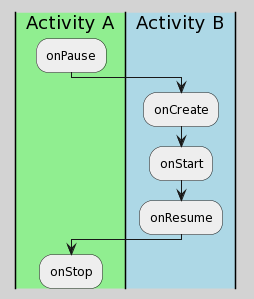
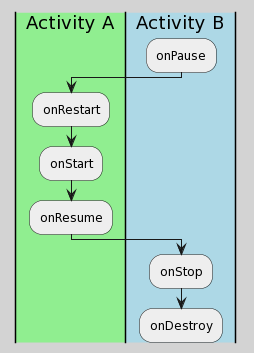

## 情形汇总
[查看](lifecycle/A.kt)

Activity跳转生命周期总结

### 1. A 跳转 B

### 2. B 返回 A

### 3. A 跳转 C（透明或对话框主题）
*  A onPause
*  C onCreate
*  C onStart
*  C onResume

### 4. C 返回 A
*  C onPause
*  A onResume
*  C onStop
*  C onDestroy

### 5. 显示A时按下Home键后A的生命周期变化
*  A onPause
*  A onStop

### 6. 横竖屏切换时的生命周期变化
*  A onPause
*  A onStop
*  A onDestroy
*  A onCreate
*  A onStart
*  A onResume

### 7. 当启动模式为singleTop或singleTask或singleInstance时，A跳转A
*  A onPause
*  A onNewIntent
*  A onResume

### 8. 当启动模式为standard，A跳转A
*  A1 onPause
*  A2 onCreate
*  A2 onStart
*  A2 onResume
*  A1 onStop

### 9. 当启动模式为standard，A再返回A
*  A2 onPause
*  A1 onRestart
*  A1 onStart
*  A1 onResume
*  A2 onStop
*  A2 onDestroy

#### 问：从Activity A跳转到Activity B，然后再点击返回键，A和B的生命周期调用流程是什么？

查看答案

<pre>
从Activity A跳转到Activity B
Activity A --> onPause()
Activity B --> onCreate()
Activity B --> onStart()
Activity B --> onResume()
Activity A --> onStop()

然后在Activity B点击back键
Activity B --> onPause()
// 注意在onStop和onStart之间有个onRestart
<b>Activity A --> onRestart()</b>
Activity A --> onStart()
Activity A --> onResume()
Activity B --> onStop()
Activity B --> onDestroy()
</pre>

***