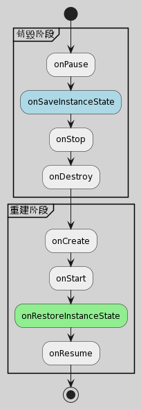

# 横竖屏切换的生命周期



## 避免Activity横竖屏切换时被销毁

在AndroidManifest.xml的activity节点中指定如下属性：

``` xml
android:configChanges = "orientation|screenSize"
```

此时横竖屏切换时会回调如下方法：
``` java
@Override
public void onConfigurationChanged(Configuration newConfig) {
    super.onConfigurationChanged(newConfig);
}
```