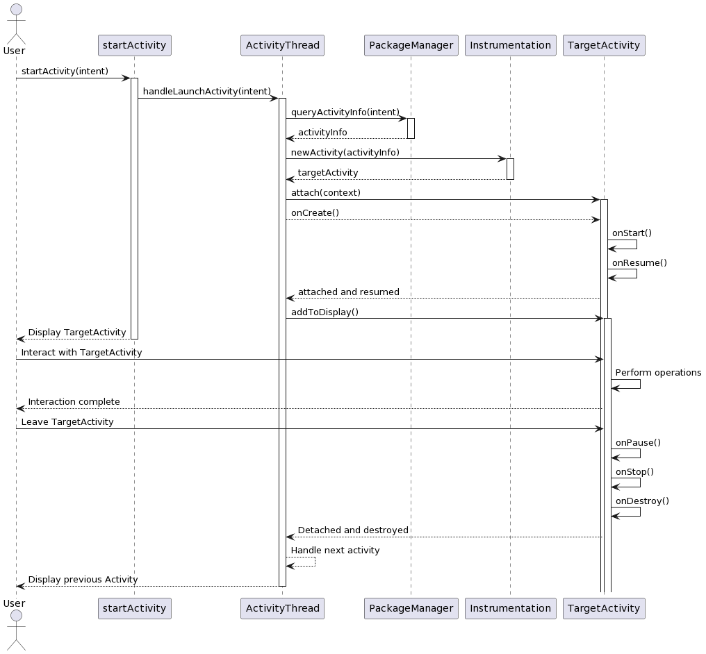

# 启动流程

## 概述



### 流程描述
1. 调用startActivity()方法，创建Intent对象并传递给ActivityThread的handleLaunchActivity()方法。
2. ActivityThread根据Intent中的信息，通过PackageManager查询目标Activity的信息。
3. ActivityThread调用Instrumentation的newActivity()方法创建目标Activity的实例。
4. ActivityThread调用目标Activity的attach()方法将其与当前的ActivityThread关联。
5. ActivityThread调用目标Activity的onCreate()、onStart()和onResume()方法，执行初始化和启动流程。
6. ActivityThread将目标Activity的Window添加到屏幕上显示。
7. 用户与目标Activity进行交互，执行相应的操作。
8. 当用户离开目标Activity或其他条件满足，ActivityThread调用目标Activity的onPause()、onStop()和onDestroy()方法，执行停止和销毁流程。
9. 如果目标Activity被覆盖或销毁，ActivityThread会将焦点返回给前一个Activity，并调用其onRestart()、onStart()和onResume()方法。
这些步骤涉及到ActivityThread、PackageManager、Instrumentation和目标Activity的交互，实现了Activity的创建、初始化、显示和生命周期的管理。

### 解释

1. **startActivity**: 表示启动Activity的调用方，负责发起启动请求。
2. **ActivityThread**: 是Android应用程序的主线程，负责管理Activity的生命周期和处理启动请求。
3. **PackageManager**: 提供应用程序包的信息和组件的信息，包括查询目标Activity的信息。
4. **Instrumentation**: 提供了与Activity的创建和管理相关的方法，负责创建目标Activity的实例。
5. **TargetActivity**: 表示启动的目标Activity，负责处理自身的生命周期和与用户的交互。

这些类在Android应用程序中扮演不同的角色：
- **startActivity**代表启动调用方，即触发Activity启动的实体。
- **ActivityThread**是应用程序的主线程，负责管理Activity的生命周期和处理启动请求。
- **PackageManager**提供应用程序包和组件的信息，用于查询目标Activity的相关信息。
- **Instrumentation**负责创建目标Activity的实例，并提供与Activity创建和管理相关的方法。
- **TargetActivity**是被启动的目标Activity，负责处理自身的生命周期和与用户的交互。

## 详述

Activity的启动过程是Android系统的核心流程之一，其涉及到ActivityManagerService、ActivityStack、ActivityThread等多个核心类的协同工作。下面通过源码与伪代码的结合，来解释Activity的启动过程。

### 1. startActivity() 调用
当你在应用程序中调用了 `startActivity(Intent)` 方法时，最终会调用到 `Activity` 类中的 `startActivityForResult()` 方法。

```java
// Activity.java
public void startActivityForResult(Intent intent, int requestCode) {
    // ...
    Instrumentation.ActivityResult ar =
        mInstrumentation.execStartActivity(
            this, mMainThread.getApplicationThread(), mToken, this,
            intent, requestCode, options);
    // ...
}
```
其中 `mInstrumentation.execStartActivity()` 最终通过 Binder 调用到了系统服务 ActivityManagerService (AMS) 的 `startActivity()` 方法。

### 2. ActivityManagerService 处理启动请求
AMS 是系统服务，管理着系统中所有的 Activity。在 AMS 的 `startActivity()` 方法中，它通过 ActivityStack 来开始一个新的 Activity。

```java
// ActivityManagerService.java
int startActivity(IApplicationThread caller, Intent intent,
        String resolvedType, int startId) {
    //...
    final int res = mActivityStarter.startActivityMayWait(caller, ...);
    //...
}
```
其中 `mActivityStarter.startActivityMayWait()` 方法中，主要做了权限检查、Intent解析、目标Activity解析等操作。

### 3. 启动新的 Activity 实例
一旦决定启动一个新的 Activity 实例，AMS 会通过 ApplicationThread 的 `scheduleLaunchActivity()` 方法来通知客户端创建一个新的 Activity 对象。

```java
// ActivityThread.java
private void handleLaunchActivity(ActivityClientRecord r, Intent customIntent) {
    //...
    Activity activity = performLaunchActivity(r, customIntent);
    //...
}
```
在 `performLaunchActivity()` 方法中，会创建 Activity 对象，并调用其 `onCreate()` 方法，完成 Activity 的创建过程。

### 4. 进入Activity生命周期
一旦 Activity 被创建，将进入其生命周期。Activity 通过依次调用 `onCreate()`、`onStart()` 和 `onResume()` 方法转入到激活状态。

```java
// Activity.java
protected void onCreate(Bundle savedInstanceState) { 
    //...
}
protected void onStart() {
    //...
}
protected void onResume() {
    //...
}
```

总结:
1. **启动 Activity**: 在我们调用 `startActivity()` 方法时，请求会被发送到 AMS 服务。
   
2. **AMS 处理请求**: AMS 通过 `ActivityStack` 与 `ActivityStarter` 处理请求，解析目标Activity，检查权限等，并决定是否要启动新的 Activity 实例。
   
3. **Activity 创建**: 如果决定启动新实例，AMS 会通知客户端，客户端（通常是 `ActivityThread`）则负责创建 Activity 实例，并调用其 `onCreate()` 方法。
   
4. **进入生命周期**: Activity 实例一旦创建，便进入其生命周期。

这个过程涉及到进程间通信（IPC）以及多个核心类的协同工作，是Android系统的核心之一。希望上述步骤能帮助你理解Activity的启动过程！