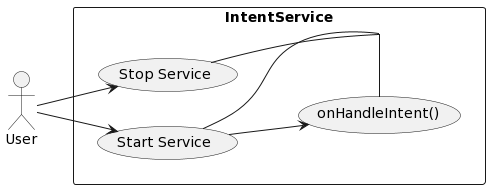

# IntentService



IntentService是一种Android Service类型，用于在后台处理异步任务。它可以接收来自其他应用或组件的请求（Intent），并在后台执行特定任务，完成后自动停止服务，减少了内存消耗和系统负担。

IntentService继承自Service类，并通过实现onHandleIntent方法实现异步操作。当有新的请求到达时，IntentService会将该请求封装成Intent对象，然后放入工作队列中进行异步处理。多个请求可以同时进入工作队列，IntentService会按照先进先出（FIFO）的顺序对请求进行处理。

相比较于普通的Service，IntentService具有以下优势：

1. 封装了异步处理逻辑，避免了开发者需要手动管理线程等复杂操作。

2. 自动停止服务，在任务结束后不会占据系统资源，避免了内存泄露等问题。

3. 支持多个任务同时处理，在保证线程安全的前提下提高了任务处理效率。

总之，IntentService是一种非常方便、高效的Service类型，适合处理后台异步任务，如下载文件、上传数据等。

## 使用IntentServcie和新建子线程的区别

|  区别 | IntentService | 新建子线程 |
| :-----:| :---------- | :--------- |
| 生命周期 | 在任务完成后自动停止服务，避免内存泄漏等问题 | 需要手动管理线程的启停，可能出现资源浪费或者崩溃等问题 |
| 线程管理 | 自动管理线程数量和优先级，简化开发者操作 | 需要手动控制线程池大小、线程优先级、线程同步等问题，非常繁琐 |
| 并行处理 | 支持多个请求同时进入工作队列进行异步处理，可以实现更高效的并行处理 | 由于线程数量受限，可能会出现任务阻塞、性能下降等问题 |
| 代码实现复杂度 | 封装了异步处理逻辑，使得代码实现更简洁清晰 | 需要考虑各种因素，如线程同步、异常处理、性能调优等，实现较为复杂 |

## IntentService在Android的高版本中被标记为弃用了吗

是的，从Android O（8.0）开始，IntentService被标记为弃用（deprecated）。原因是Android O引入了新的后台执行限制，需要应用开发者使用JobScheduler等新的API来替代IntentService进行后台任务处理。

在Android O之后的版本中，如果应用程序继续使用IntentService进行后台任务处理，可能会遇到一些限制和问题，比如无法正常启动服务、无响应、长时间卡顿等。因此，建议应用程序尽快迁移到新的后台任务处理方式。

替代IntentService的API主要有以下两种：

1. JobScheduler：是一种新的API，它可以帮助应用程序调度任务，并根据设备状态、电池电量等条件进行自动调整，从而实现更加灵活高效的后台任务处理。

2. WorkManager：是一个库，兼容Android API 14+，提供了一套标准化的用于管理异步任务和后台任务的API，并且可与Jetpack组件集成使用。

以上两种API都是Google推荐的后台任务处理方式，在保证了性能和安全的前提下，兼顾了开发者和用户的使用体验。因此，在Android O及以上版本中，推荐使用JobScheduler或WorkManager进行后台任务处理。


## 代码示例
```java
public class DownloadService extends IntentService {
 
   public static final int UPDATE_PROGRESS = 8344;
 
   public DownloadService() {
      super("DownloadService");
   }
 
   @Override
   protected void onHandleIntent(Intent intent) {
      
      // 获取传递过来的下载链接和保存路径信息
      String urlToDownload = intent.getStringExtra("urlToDownload");
      String fileSavePath = intent.getStringExtra("fileSavePath");

      try {
         // 创建下载连接对象
         URL url = new URL(urlToDownload);
         HttpURLConnection connection = (HttpURLConnection) url.openConnection();
         connection.setDoInput(true);
         connection.connect();

         // 获取文件大小并计算进度条的最大值
         int fileLength = connection.getContentLength();
         int progressMaxValue = fileLength / 1024;

         // 创建输入输出流
         InputStream inputStream = connection.getInputStream();
         FileOutputStream outputStream = new FileOutputStream(fileSavePath);

         byte[] buffer = new byte[1024];
         int len, downloadedSize = 0, progress = 0;

         // 开始进行文件下载
         while ((len = inputStream.read(buffer)) != -1) {
            outputStream.write(buffer, 0, len);
            downloadedSize += len;
            progress = downloadedSize / 1024;
            
            // 发送广播更新下载进度
            Intent broadcastIntent = new Intent();
            broadcastIntent.setAction("DOWNLOAD_PROGRESS_UPDATE");
            broadcastIntent.putExtra("progress", progress);
            sendBroadcast(broadcastIntent);
         }

         // 关闭输入输出流
         outputStream.close();
         inputStream.close();

      } catch (Exception e) {
         e.printStackTrace();
      }
   }
}

```

## 总结

1. 继承自Service。
2. 默认运行在子线程（内部开启了一个HandlerThread，需要实现方法onHandleIntent）。
3. 可以启动多次，每个任务会以队列的形式在onHandleIntent方法中依次执行。
4. 当所有任务执行完成后，会自动停止。
