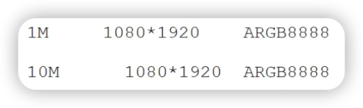

# 1M的图片和10M的图片宽高相等加载的内存一样吗

## 概述

是一样的。

<blockquote>
图片占据内存大小以下三个因素相关，和文件存储大小无关：

1. 分辨率。
2. 像素格式。
3. 图片所处的dpi文件夹和手机的densityDpi(屏幕密度)。
</blockquote>

## 详述

在 Android 中，图片的内存占用主要和它的分辨率（即宽高）及颜色深度（像素格式）有关，而不是它的文件大小。当一个图片被解码成一个 `Bitmap` 对象时，它占用的内存是基于像素数量的。简单来说：

\[
\text{内存占用} = \text{宽度} \times \text{高度} \times \text{每像素占用的字节数}
\]

其中“每像素占用的字节数”取决于 `Bitmap` 的配置。例如，如果是 `ARGB_8888` 配置（默认配置），每一个像素占用 4 字节（每个通道占 1 字节，一共 4 个通道：Alpha、Red、Green、Blue）。如果是 `RGB_565` 配置，则每个像素占用 2 字节。

所以，如果 1M 的图片和 10M 的图片的宽和高相等，并且它们的 `Bitmap.Config` 也相等，则它们在解码成 `Bitmap` 对象时占用的内存是相同的。文件大小的差异通常来自图片的压缩率，不同的图片压缩算法和压缩质量将导致文件大小的差异，但解码后的像素数据（即 `Bitmap` 对象）占用的内存是一样的（如果分辨率和配置相同）。

这也解释了为什么高压缩率的图片（文件小）在解码显示时，可能与原图几乎无差别：因为它们解码后的 `Bitmap` 对象占用的内存是一样的，从而能够展示同样的细节和色彩。