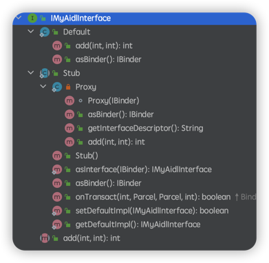

# AIDL生成的Java类细节



## Stub
``` java
/** Local-side IPC implementation stub class. */
public static abstract class Stub extends android.os.Binder implements IMyAidlInterface
{
    private static final java.lang.String DESCRIPTOR = "IMyAidlInterface";
    /** Construct the stub at attach it to the interface. */
    public Stub()
    {
      this.attachInterface(this, DESCRIPTOR);
    }
    
    /**
     * Cast an IBinder object into an IMyAidlInterface interface,
     * generating a proxy if needed.
     */
    public static IMyAidlInterface asInterface(android.os.IBinder obj)
    {
      if ((obj==null)) {
        return null;
      }
      
      // 判断服务端和客户端是否在同一个进程
      android.os.IInterface iin = obj.queryLocalInterface(DESCRIPTOR);
      if (((iin!=null)&&(iin instanceof IMyAidlInterface))) {
        // 同进程则直接返回IMyAidlInterface
        return ((IMyAidlInterface)iin);
      }
      // 不同进程则返回Proxy
      return new IMyAidlInterface.Stub.Proxy(obj);
    }

    @Override 
    public android.os.IBinder asBinder()
    {
      return this;
    }

    @Override 
    public boolean onTransact(int code, android.os.Parcel data, android.os.Parcel reply, int flags) throws android.os.RemoteException
    {
      java.lang.String descriptor = DESCRIPTOR;
      switch (code)
      {
        case INTERFACE_TRANSACTION:
        {
          reply.writeString(descriptor);
          return true;
        }
        case TRANSACTION_add:
        {
          data.enforceInterface(descriptor);
          int _arg0;
          _arg0 = data.readInt();
          int _arg1;
          _arg1 = data.readInt();
          int _result = this.add(_arg0, _arg1);
          reply.writeNoException();
          reply.writeInt(_result);
          return true;
        }
        default:
        {
          return super.onTransact(code, data, reply, flags);
        }
  }
}
```

## Proxy
``` java
 private static class Proxy implements IMyAidlInterface
    {
      private android.os.IBinder mRemote;
      
      Proxy(android.os.IBinder remote)
      {
        mRemote = remote;
      }
      
      @Override public android.os.IBinder asBinder()
      {
        return mRemote;
      }
      
      public java.lang.String getInterfaceDescriptor()
      {
        return DESCRIPTOR;
      }
      
      @Override public int add(int a, int b) throws android.os.RemoteException
      {
        // 发送给服务端的数据包
        android.os.Parcel _data = android.os.Parcel.obtain();
        // 用于接收服务端返回的数据
        android.os.Parcel _reply = android.os.Parcel.obtain();
        int _result;
        try {
          _data.writeInterfaceToken(DESCRIPTOR);
          _data.writeInt(a);
          _data.writeInt(b);
          // 挂起线程，等待服务端返回
          boolean _status = mRemote.transact(Stub.TRANSACTION_add, _data, _reply, 0);
          if (!_status && getDefaultImpl() != null) {
            return getDefaultImpl().add(a, b);
          }
          _reply.readException();
          _result = _reply.readInt();
        }
        finally {
          _reply.recycle();
          _data.recycle();
        }
        return _result;
      }
      public static IMyAidlInterface sDefaultImpl;
    }
    
    static final int TRANSACTION_add = (android.os.IBinder.FIRST_CALL_TRANSACTION + 0);
    
    public static boolean setDefaultImpl(IMyAidlInterface impl) {
      // Only one user of this interface can use this function
      // at a time. This is a heuristic to detect if two different
      // users in the same process use this function.
      if (Stub.Proxy.sDefaultImpl != null) {
        throw new IllegalStateException("setDefaultImpl() called twice");
      }
      if (impl != null) {
        Stub.Proxy.sDefaultImpl = impl;
        return true;
      }
      return false;
    }
    
    public static IMyAidlInterface getDefaultImpl() {
      return Stub.Proxy.sDefaultImpl;
    }
  }
```
