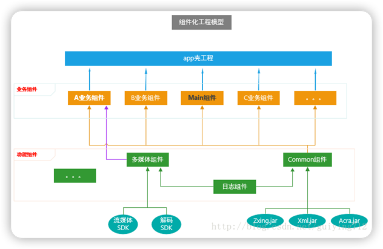
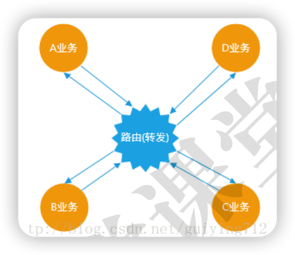

# 组件化架构

## 组件化工程模型

### 预备知识点
1. **集成模式**：所有的业务组件被“app壳工程”依赖，组成一个完整的APP；
2. **组件模式**：可以独立开发业务组件，每一个业务组件就是一个APP；
3. **app壳工程**：只负责管理各个业务组件、打包apk，没有具体的业务功能；
4. **业务组件**：根据公司具体业务而独立形成一个的工程；
5. **功能组件**：提供开发APP的某些基础功能（如打印日志、树状图等）；
6. **Main组件**：属于业务组件，指定APP启动页面、主界面；
7. **Common组件**：属于功能组件，支撑业务组件的基础，提供多数业务组件需要的功能，例如提供网络请求功能；

### 组件化架构的目标
1. 让业务之间相对独立。
2. 在组件模式下，各个业务组件(application)可以独立开发。
3. 在集成模式下，业务组件(library)可变为arr包集成到“app壳工程”中，组成完整APP。

> 🤔：业务组件相互独立后，如何进行"通信"？
>
> 
> > 通过“路由”(中转站)间接产生联系，Android中的路由实际就是对URL Scheme的封装。