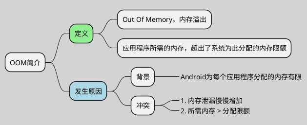
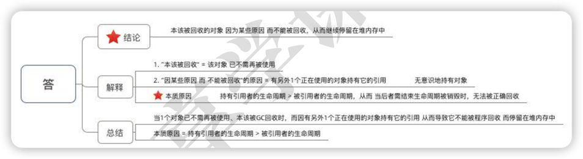
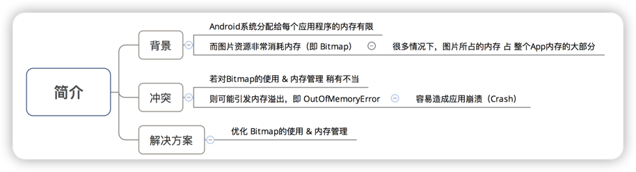
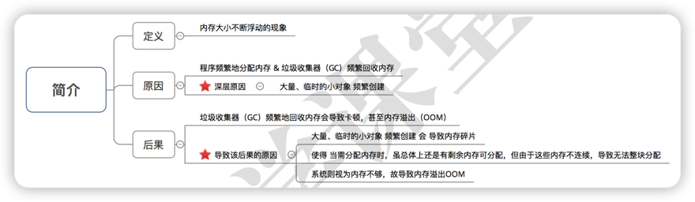
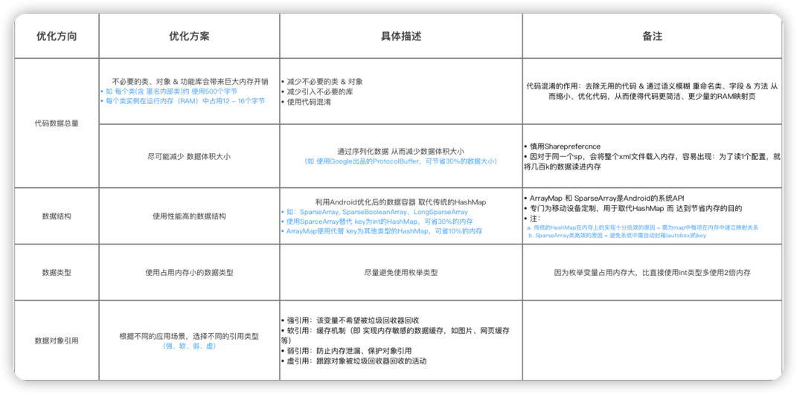
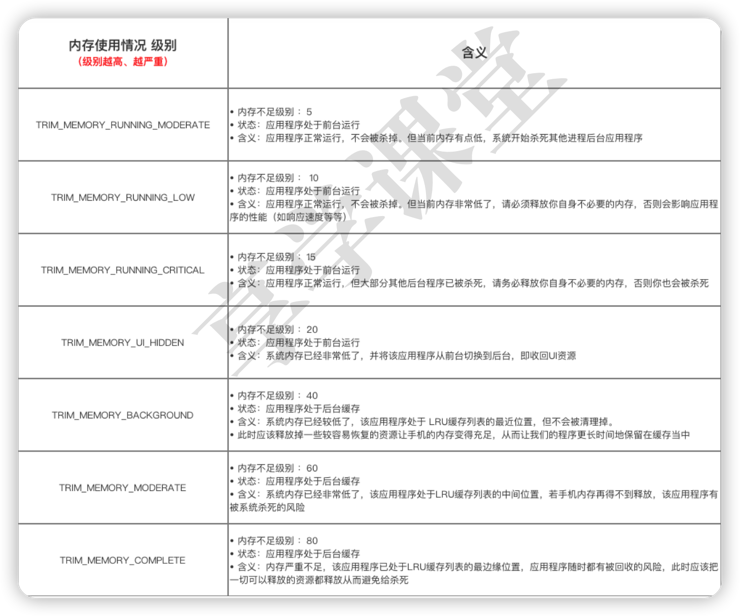

# 常见的内存问题

1. OOM
2. 内存泄漏
3. Bitmap相关
4. 内存抖动
5. 代码质量 & 数量

***

## OOM

## 内存泄漏

**回收对象的引用被长生命周期对象持有**。

### 常见内存泄露原因

**记忆：集合、静态、非静态、资源**

1. 对象集合类
2. 静态成员变量
3. 非静态内部类
4. 资源使用未关闭

***

## Bitmap相关

### 优化方向

记忆：**像素点、一个bitmap、多个bitmap**。

1. 及时释放图片资源
    1. Bitmap.Recycle()
    2. 采用软引用
2. 根据分辨率适配&缩放图片
    1. 设置多套图片资源
    2. 设置合适采样率：inSampleSize
3. 合适的解码方式
    1. inPreferredConfig
4. 图片缓存
    1. 三级缓存
    
***

## 内存抖动

记忆：**频繁new和GC，内存碎片、卡顿**。

### 优化方案
尽量避免频繁创建大量、临时的小对象。

***

## 代码质量 & 数量

通知虚拟机应用程序需更大的堆内存：AndroidManifest.xml的application标签中增加一个
android:largeHeap属性值。（但不建议 & 不鼓励）

## 技巧
1. 获取当前可使用的内存大小
   ActivityManager.getMemoryClass（）（单位：兆）
2. 获取当前的内存使用情况
   onTrimMemory()获取应用程序当前内存使用情况（以内存级别进行识别），
   可根据该方法返回的内存紧张级别参数 来释放内存
   
   
3. 当视图变为隐藏状态时，则释放内存
   实现当前Activity类的onTrimMemory()后，当用户离
   开视图时会得到通知；若得到返回的参数 =
   TRIM_MEMORY_UI_HIDDEN 即代表视图变为隐藏状态，则可释放视
   图所占用的资源。
   

