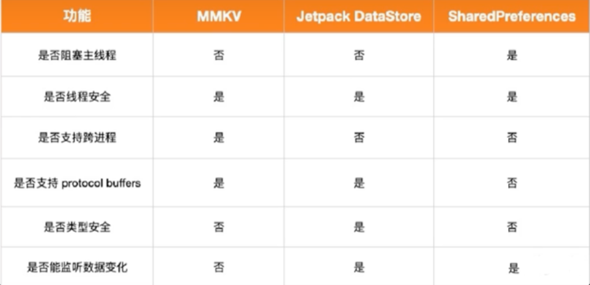

# SharedPreferences

## 概述
SharedPreferences是Android中<font color=#dea32c>**轻量级**</font>的数据存储方式，适用于保存简单的数据类型。
其内部是以xml结构保存在<font color=#009ad6>**/data/data/{包名}/shared_prefs**</font>文件夹下的。数据以<font color=#dea32c>**键值对**</font>的形式保存，如下所示：
```xml
<map>
    <float name="isFloat" value="1.5" />
    <string name="isString">Android</string>
    <int name="isInt" value="1" />
    <long name="isLong" value="1000" />
    <boolean name="isBoolean" value="true" />
    <set name="isStringSet">
        <string>element 1</string>
        <string>element 2</string>
        <string>element 3</string>
    </set>
</map>
```

## 详述

`SharedPreferences` 是 Android 平台上一个轻量级的存储类，主要用来保存应用的一些常用配置，比如用户的登录状态、配置信息、用户的个人信息等。由于其轻量级的特点，通常适用于保存简单的数据格式（键值对）。

### 基本使用

下面展示了如何使用 `SharedPreferences` 来存储和读取数据。

#### 1. 存储数据

```java
// 获取SharedPreferences对象
SharedPreferences sharedPreferences = getSharedPreferences("MyPreferences", MODE_PRIVATE);
// 获取Editor对象
SharedPreferences.Editor editor = sharedPreferences.edit();
// 存储键值对
editor.putString("username", "Alice");
editor.putInt("userage", 30);
// 提交数据
editor.apply();
```

#### 2. 读取数据

```java
// 获取SharedPreferences对象
SharedPreferences sharedPreferences = getSharedPreferences("MyPreferences", MODE_PRIVATE);
// 读取键值对，第二个参数是默认值，当键不存在时返回该值
String username = sharedPreferences.getString("username", "defaultName");
int userage = sharedPreferences.getInt("userage", 0);
```

### 使用模式

在获取 `SharedPreferences` 对象时，通常需要传入两个参数：

- 第一个参数是 `SharedPreferences` 文件的名字。
- 第二个参数是文件的操作模式，常见的有：
  - `MODE_PRIVATE`：私有模式，只有当前应用才能对这个文件进行读写。
  - `MODE_WORLD_READABLE`：其他所有应用都可以读。
  - `MODE_WORLD_WRITEABLE`：其他所有应用都可以写。

注意：从 Android 4.2 开始，`MODE_WORLD_READABLE` 和 `MODE_WORLD_WRITEABLE` 已被弃用，因为它们允许其他应用访问你的应用数据，存在安全隐患。

### SP与其它方案比较

<div align=center></div>

### 注意事项

- `SharedPreferences` 适合存储轻量级的、简单的数据，不建议存储大量或复杂的数据。
- 读取和写入 `SharedPreferences` 是线程安全的，但如果你在多个进程中修改它们，你应该使用 `MODE_MULTI_PROCESS` 模式或者使用一个 ContentProvider。
- `SharedPreferences` 写入数据时要避免在主线程进行，因为当数据比较大的时候，可能会导致性能问题或阻塞主线程。

通过 `SharedPreferences` ，你可以方便地存储和管理应用的配置信息，但应确保它们的使用场景是适合的。