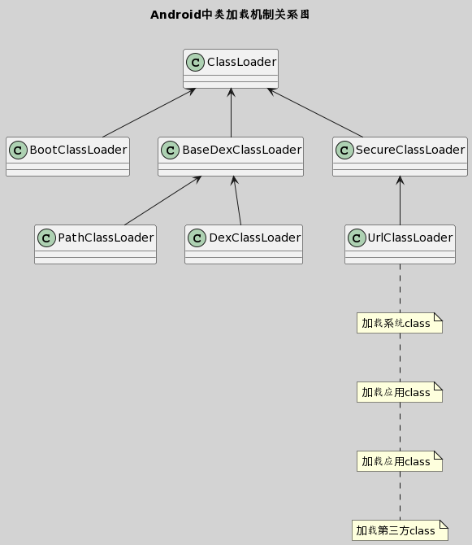

# Android类加载机制

## 概述

Android的类加载机制是指在Android应用程序运行时，如何加载和使用类。Android使用的是动态类加载机制，主要包括以下步骤：
1. **Dex文件生成**：将Java源代码编译为Dalvik字节码，生成Dex文件。
2. **类加载器**：使用PathClassLoader或DexClassLoader加载Dex文件和系统类。
3. **类加载顺序**：先加载系统类，然后加载应用程序的类。
4. **类加载过程**：根据类的全限定名，找到对应的Dex文件，将Dex文件加载到内存中，并将类信息实例化。
5. **类缓存**：已加载的类会被缓存，避免重复加载。通过类加载机制，Android可以实现动态加载和使用类，支持灵活的组件化和插件化开发。

## 详述

在 Android 系统中，类加载器（ClassLoader）的主要作用是加载应用程序中的类。Android 的类加载机制与标准 Java 稍有不同，由于 Android 应用的特殊性（例如 APK 文件格式、Dalvik/ART 运行时等），其类加载器也具有一些独特之处。

### 常见的类加载器

在 Android 中，常见的类加载器有：

- **BootClassLoader**: 负责加载 Android 系统中的核心类库，例如 android.* 包中的类。
- **PathClassLoader**: 用于加载 Android 应用默认的类。
- **DexClassLoader**: 可以加载 APK、JAR 和 DEX 文件的类加载器，通常用于实现插件化技术。

### Android 类加载过程

当 Android 应用启动时，系统会通过 Zygote 进程克隆出一个新的 App 进程，并为这个进程分配一个独立的 `ClassLoader` 实例。下面是一个简化的类加载过程：

1. **类加载请求**: 当一个类被首次引用时，会触发类的加载过程。
   
2. **加载类文件**: ClassLoader 会根据类的全限定名，在对应的文件（例如 APK）中寻找对应的 .dex 文件，并加载这个文件。
   
3. **链接**: 进行验证、准备以及解析步骤，确保类可被 JVM 运行。

4. **初始化**: 对类的静态变量进行初始化。

5. **使用**: 应用开始正常使用类。
   
6. **卸载**: 当类不再被使用且被垃圾收集器标记时，类会被卸载。

### Dex 文件

Android 平台上的 Java 源代码会被编译成 Dex（Dalvik Executable）文件，它是专门针对 Android 平台设计的一种可执行文件格式。在运行时，ClassLoader 会解析 Dex 文件，将其加载到 Android 运行时的内存中以供使用。

### 类加载的特点

- **双亲委派模型**: 与标准的 Java 类加载器一样，Android 中的类加载器也使用双亲委派模型。简单来说，这个模型确保类在加载时首先请求其父加载器进行加载，直到 Bootstrap 类加载器。如果父加载器不能加载这个类，那么才由自身加载。

- **热修复与插件化**: 由于 Android 允许使用自定义的 ClassLoader，开发者可以通过改变 ClassLoader 的加载路径（例如使用 `DexClassLoader`）来支持热修复和插件化。热修复通常用来在不升级 APK 的情况下修复线上 Bug，而插件化可以让开发者在不重启应用的情况下动态加载和运行 APK 文件。

### 注意

虽然 Android 提供了一些动态加载类的能力，但由于各种原因（例如安全性、稳定性等），Google Play 策略明确禁止了应用在运行时动态链接不包含在 APK 中的可执行代码。因此，在开发商业化的应用时，需要谨慎使用动态加载技术，并且确保它符合各大应用市场的政策。

Android 的类加载机制是一个复杂的过程，上述内容提供了一个宏观的视角，具体的实现细节可能会随着 Android 版本的更新而有所变化。

## 补充

<div align=center></div>

### 🤔 在Activity中打印ClassLoader的类名，结果是什么？

``` java
// MainActivity.java
ClassLoader classLoader = getClassLoader();
// 打印结果是dalvik.system.PathClassLoader
System.out.println(classLoader.getClass().getName())
```
