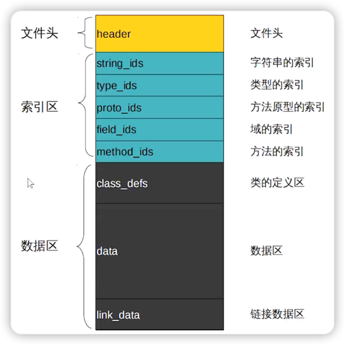

# Dex文件

## 为什么要了解Dex文件？

学习APK瘦身、热修复、插件化、应用加固、逆向工程的重点。

## 什么是Dex文件？

### JVM → Dalvik → ART

JVM是Java虚拟机，但是不能直接用于安卓系统，所以定制了dalvik虚拟机；后来在android4.4之后又推出了性能更好的ART（android runtime）。

Dalvik 虚拟机并不支持直接执行 JAVA 字节码，所以会对编译生成的 .class 文件进行翻译、重构、解释、压缩等处理，这个处理过程是由 dx 进行处理，处理完成后生成的产物会以 .dex 结尾，称为 Dex 文件。

### 构成

如果把Dex理解为一本书

1. 书本封面：文件头
2. 书本目录：索引区
3. 书本内容：数据区

