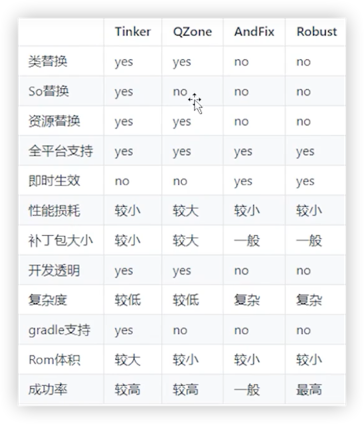
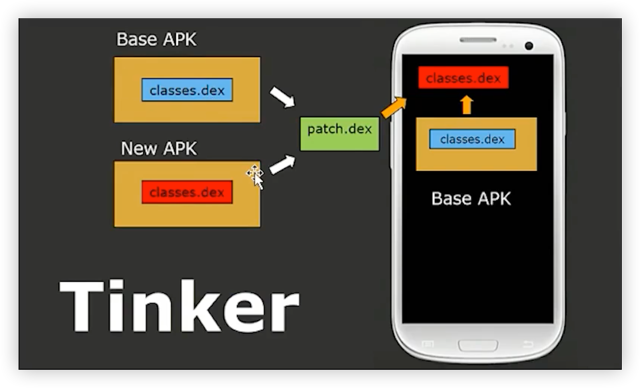

# Tinker热修复原理

## 概述

Tinker的热修复原理是：
1. 通过将补丁文件与原始APK进行合并，生成新的可执行文件。
2. 在运行时，Tinker加载原始APK和补丁文件，将补丁文件中的修复或新增的代码、资源等内容动态替换原始APK中的对应部分。

这样，应用就能在不重新安装的情况下实现Bug修复和功能更新，提供了灵活的热修复能力。

## 详述

Tinker 是由腾讯开发的一个用于 Android 热修复（Hotfix）的框架。其实现机制主要基于 Android 的 ClassLoader 机制和 Dex 文件格式。Tinker 可以在不需要重新安装 APK 的情况下修复 APP 的 Java 代码、资源文件和 SO 库。下面我们主要关注其修复 Java 代码的基本原理。

### Tinker 热修复的基本原理

#### 1. **Patch 生成**

- 开发者在本地修复 Bug 后，将修复后的 APK 与有 Bug 的 APK 通过 Tinker 提供的工具生成一个 Patch 文件。
- Patch 文件主要包含差异部分的 Dex 文件、资源文件等。

#### 2. **Patch 下发**

- 通过某种方式（比如请求服务器）将 Patch 文件下发到目标用户的设备上。

#### 3. **Patch 合成**

- Tinker 会将下发的 Patch 文件与原 APK 合并，生成一个新的 Dex 文件（和其他可能的资源或 SO 文件）。
- 该合成操作通常在 APP 启动的时候完成，并存储在设备的本地存储中。

#### 4. **加载补丁**

- 当 APP 启动时，Tinker 会通过自定义的 ClassLoader 加载合成后的新 Dex 文件。
- 通过修改原有 APP 的 ClassLoader，让其在加载类时优先从新生成的 Dex 文件中加载。
  
#### 5. **执行补丁代码**

- 由于 ClassLoader 的替换，当 APP 运行到被修复的代码部分时，会使用新的（修复后的）代码逻辑。

### Tinker 实现关键点

#### 1. **ClassLoader 替换**

- Tinker 会创建一个新的 DexClassLoader 实例，这个实例会负责加载合成后的新 Dex 文件。
- Tinker 使用反射机制修改 PathClassLoader 的 DexPathList，使其优先从新生成的 Dex 文件中加载类。

#### 2. **Dex 文件合成**

- Tinker 的 Dex 文件合成采用了 BSdiff 差分算法，只对改变的类进行修复，从而最小化 Patch 文件的大小。
- 合成过程在设备本地完成，减少了网络传输的开销和对服务端的依赖。

#### 3. **多 Dex 支持**

- Tinker 支持多 Dex 文件的修复，它能够正确处理由于方法数量超过 65536 而分割的 Dex 文件。
  
#### 4. **资源和 SO 库的修复**

- Tinker 不仅仅支持 Java 代码的修复，还支持资源文件和 SO 库的修复。

### 注意

- Tinker 在一些极端情况下可能会失效，比如在一些系统中 ClassLoader 的实现方式不同或被定制等。
- Tinker 需要占用一部分磁盘空间存储 Patch 文件和合成后的 Dex 文件，可能会增加 APP 的磁盘占用。
- 热修复技术并不是万能的，它只适合修复一些不太严重的 Bug，对于一些严重 Bug（如安全漏洞）的修复，建议通过正常的升级渠道来进行。
- 使用热修复技术时要严格遵守相关市场的政策，比如 Google Play 对动态更新代码的政策。

Tinker 的源码是开源的，你可以在 GitHub 上找到。如果你对 Tinker 的实现细节感兴趣，建议深入阅读其源码。

## 补充：热修复方案

Tinker通过计算对比指定的Base Apk中的dex与修改后的Apk中的dex的区别，补丁包中的内容即为两者差分的描述。 运行时将Base
Apk中的dex与补丁包进行合成，重启后加载全新的合成后的dex文件。

