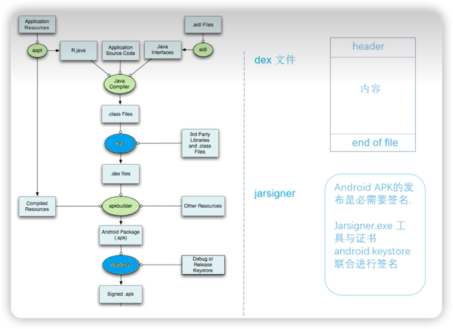

# APK打包流程

## 核心思路
1. 3个生成
2. dex
3. 打包
4. 签名

## 1. 3个生成

1. aapt打包资源文件，生成**R.java**文件。
2. 处理aidl文件，生成相应的Java文件。
3. 编译项目源代码，生成class文件。

## 2. 将class转换为dex文件

## 3. apkbuilder打包

将资源文件和dex文件打包进apk中。

> 打包的工具apkbuilder：
> 1. 位于android-sdk/tools目录下。
> 2. apkbuilder为一个脚本文件，实际调用的是android-sdk/tools/lib/sdklib.jar文件中的ApkbuilderMain类。

## 4. 签名

### 对签名后的APK文件进行对齐处理

如果发布的apk是正式版的话，就必须对APK进行对齐处理，用到的工具是zipalign，它位于android-sdk/tools目录下。

对齐的主要过程是将APK包中所有的资源文件距离文件起始偏移为4字节整数倍，这样通过内存映射访问apk文件时速度会更快。

对齐的作用就是减少运行时内存的使用。