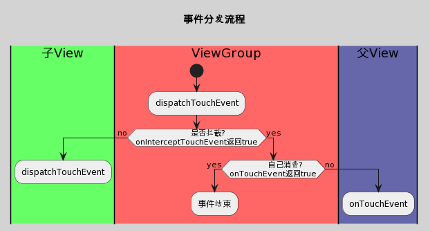

# dispatchTouchEvent
分发触摸事件。

```
public boolean dispatchTouchEvent(MotionEvent event)
```

## 作用
用来进行事件的分发，如果事件能够传递给当前View，那么dispatchTouchEvent方法一定会被调用。

## 返回值
表示是否消费了当前事件。
1. true：表示事件被消费，本次的事件终止
2. false：表示View以及子View均没有消费事件，将调用父View的onTouchEvent方法。



以下伪代码展示了dispatchTouchEvent、onInterceptTouchEvent、onTouchEvent三者的关系：
```java
public boolean dispatchTouchEvent(MotionEvent ev) {
    // 事件是否被消费
    boolean consume = false;
    // 调用onInterceptTouchEvent判断是否拦截事件
    if (onInterceptTouchEvent(ev)){
        // 如果拦截则调用自身的onTouchEvent方法
        consume = onTouchEvent(ev);
    }else{
        // 不拦截调用子View的dispatchTouchEvent方法
        consume = child.dispatchTouchEvent(ev);
    }
    // 返回值表示事件是否被消费
    // true表示事件终止
    // false表示调用父View的onTouchEvent方法
    return consume;
}
```
换个思路去理解：
```java
/**
 * 上级领导向下级员工下发任务
 */
public boolean dispatchTouchEvent(MotionEvent ev) {
    // 任务是否被处理
    boolean consume = false;
    // 是否拦截任务交给自己处理
    if (onInterceptTouchEvent(ev)){
        // 拦截任务，并调用onTouchEvent进行处理
        consume = onTouchEvent(ev);
    }else{
        // 不拦截任务，交给自己直属下级处理
        consume = child.dispatchTouchEvent(ev);
    }
    // 返回值表示任务是否被处理
    // true表示任务被处理
    // false表示任务没有被处理，将返回给上级处理。
    return consume;
}
```

## 总结
1. 三个方法的执行顺序：dispatchTouchEvent -> onInterceptTouchEvent -> onTouchEvent。
2. dispatchTouchEvent：用于分发事件，返回true表示触摸事件结束，分会false会调用父容器的onTouchEvent。
