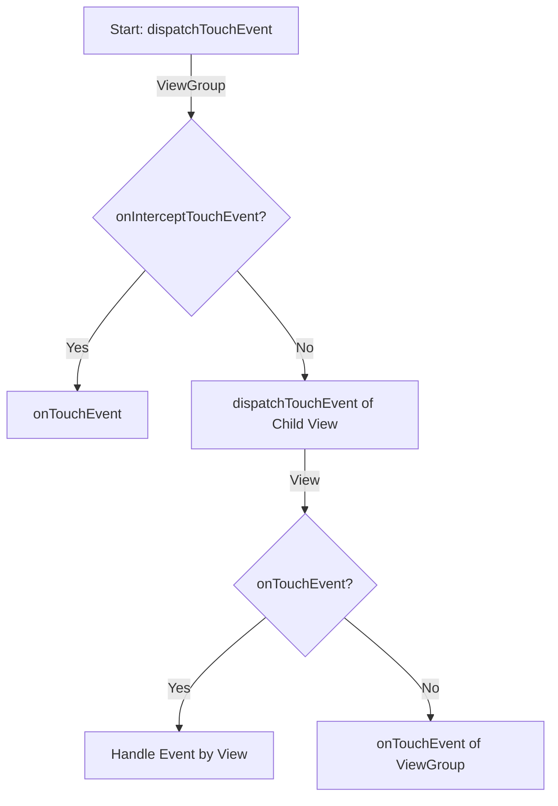

# onTouchEvent
当触摸事件（发生）

```
public boolean onTouchEvent(MotionEvent ev)
```

## 简介
1. 在dispatchTouchEvent中调用，用来处理触摸事件。

## 返回值
1. true：表示事件被消费，本次的事件终止。
2. false：表示事件没有被自己和自己的下级所消费，将调用父View的onTouchEvent方法。

## 总结


