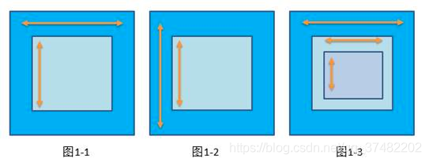

# 冲突类型和解决思路
在Android中，滑动冲突的类型有以下几种：

1. 父子控件之间的滑动冲突：当父控件和子控件都可以响应滑动手势时，就容易产生滑动冲突。通常解决这种滑动冲突的方式就是在父控件或子控件上处理事件拦截。

2. 多个子控件之间的滑动冲突：在多个子控件上同时进行滑动操作时，也容易产生滑动冲突。这种情况下，我们可以通过在滑动事件的监听器中手动调用 `getParent().requestDisallowInterceptTouchEvent(true)` 来防止父控件拦截滑动事件。

3. 横向和纵向滑动冲突：当一个控件既可以横向滑动，又可以竖向滑动时，也容易产生滑动冲突。这种情况下，我们可以通过判断滑动的距离和角度来确定用户的意图，并将事件分发到对应的方向上去处理。

4. 嵌套滑动冲突：在支持嵌套滑动的控件中，外部和内部的滑动操作也容易产生滑动冲突。这种情况下，我们可以通过实现 `NestedScrollingChild` 和 `NestedScrollingParent` 接口来解决嵌套滑动冲突问题。

## 外部和内部滑动方向不一致

> 比如 ViewPager 嵌套 ListView。

### 解决思路
通过判断滑动的方向来决定事件的处理对象。

[判断滑动方向](doc/判断滑动方向.md)

 

## 外部和内部滑动方向一致
> ScrollView 嵌套 ListView。

### 解决思路
根据实际业务需要来决定。

> 例如向下滑动时，判断ListView是否已经滑动到底部，如果是则滑动外部ScrollView，否则滑动ListView。

 

## 前两种的嵌套

