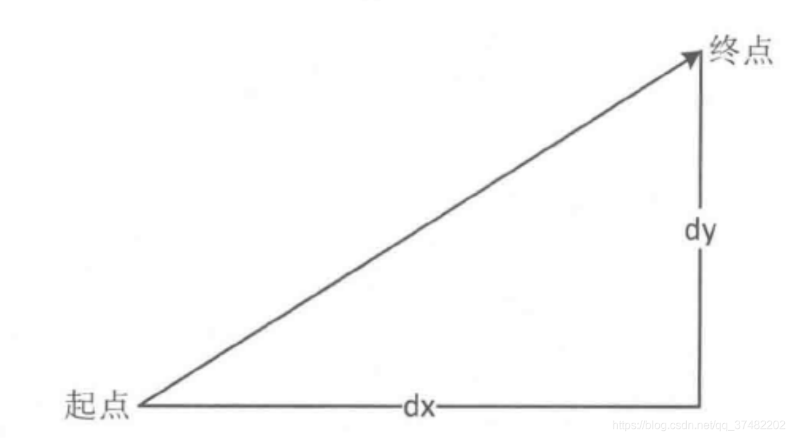

# 滑动方向的判断

## 简要思路

1. 获取滑动的终点坐标和起点坐标。
2. 计算出水平位移和垂直位移。
3. 进行比较判别。



## 代码实现

在Android中，我们可以通过判断滑动的距离和角度来确定用户的滑动方向。具体方法如下：

1. 在 `onTouchEvent` 方法中记录当前触摸点的坐标，以及上一次触摸点的坐标。

```java
private float mLastX;
private float mLastY;

@Override
public boolean onTouchEvent(MotionEvent event) {
    switch (event.getAction()) {
        case MotionEvent.ACTION_DOWN:
            mLastX = event.getX();
            mLastY = event.getY();
            break;
        case MotionEvent.ACTION_MOVE:
            float x = event.getX();
            float y = event.getY();
            float dx = x - mLastX;
            float dy = y - mLastY;
            // TODO: 计算滑动距离和角度，并根据情况执行对应的操作
            mLastX = x;
            mLastY = y;
            break;
        case MotionEvent.ACTION_UP:
        case MotionEvent.ACTION_CANCEL:
            // 清除记录的触摸点信息
            mLastX = 0;
            mLastY = 0;
            break;
    }
    return true;
}
```

2. 计算滑动距离和角度，并根据情况执行对应的操作。

```java
float distanceX = Math.abs(dx);
float distanceY = Math.abs(dy);
if (distanceX > distanceY) {
    // 横向滑动
    if (dx > 0) {
        // 向右滑动
    } else {
        // 向左滑动
    }
} else {
    // 竖向滑动
    if (dy > 0) {
        // 向下滑动
    } else {
        // 向上滑动
    }
}

// 计算滑动角度
double angle = Math.atan2(distanceY, distanceX) / Math.PI * 180;
if (angle >= 45 && angle < 135) {
    // 上滑
} else if (angle >= -45 && angle < 45) {
    // 右滑
} else if (angle >= -135 && angle < -45) {
    // 下滑
} else {
    // 左滑
}
```

以上代码仅供参考，实际使用中需要根据具体情况进行调整。