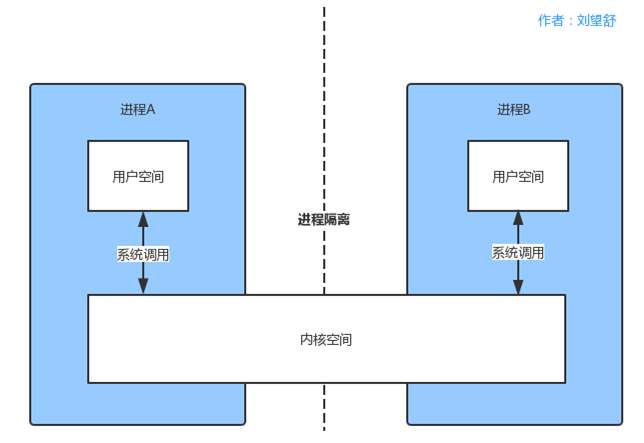
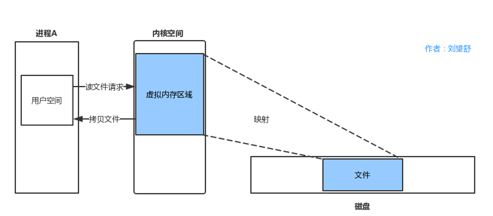

# Android中的IPC机制

## Messenger

Messenger在Android应用开发中的使用频率不高，可以在不同进程中传递Message对象，在Message中加入我们想要传的数据就可以在进程间的进行数据传递了。Messenger是一种轻量级的IPC方案并对AIDL进行了封装。

## AIDL

AIDL全名为Android interface definition Language，即Android接口定义语言。Messenger是以串行的方式来处理客户端发来的信息，如果有大量的消息发到服务端，服务端仍然一个一个的处理再响应客户端显然是不合适的。另外还有一点，Messenger用来进程间进行数据传递但是却不能满足跨进程的方法调用，这个时候就需要使用AIDL了。

## 文件共享

两个进程通过读写同一个文件来进行数据共享，共享的文件可以是文本、XML、JOSN。文件共享适用于对数据同步要求不高的进程间通信。

## ContentProvider

ContentProvider为存储和获取数据了提供统一的接口，它可以在不同的应用程序之间共享数据，本身就是适合进程间通信的。ContentProvider底层实现也是Binder，但是使用起来比AIDL要容易许多。系统中很多操作都采用了ContentProvider，例如通讯录，音视频等，这些操作本身就是跨进程进行通信。

## Binder

### 内核空间和用户空间

### 进程隔离

一个进程不能直接操作或者访问另一个进程。也就是进程A不可以直接访问进程B的数据。

### 系统调用

系统调用是用户空间访问内核空间的唯一方式，保证了所有的资源访问都是在内核的控制下进行的，避免了用户程序对系统资源的越权访问，提升了系统安全性和稳定性。
> 进程A和进程B的用户空间可以通过如下系统函数和内核空间进行交互。
> 
> copy_from_user：将用户空间的数据拷贝到内核空间。
> 
> copy_to_user：将内核空间的数据拷贝到用户空间。

### 内存映射

内存映射，把设备物理地址映射到进程虚拟内存区。

如果用户空间需要读取磁盘的文件，如果不采用内存映射，那么就需要在内核空间建立一个页缓存，页缓存去拷贝磁盘上的文件，然后用户空间拷贝页缓存的文件，这就需要两次拷贝。

由于新建了虚拟内存区域，那么磁盘文件和虚拟内存区域就可以直接映射，少了一次拷贝。

内存映射全名为Memory Map，在Linux中通过系统调用函数mmap来实现内存映射。将用户空间的一块内存区域映射到内核空间。映射关系建立后，用户对这块内存区域的修改可以直接反应到内核空间，反之亦然。内存映射能减少数据拷贝次数，实现用户空间和内核空间的高效互动。