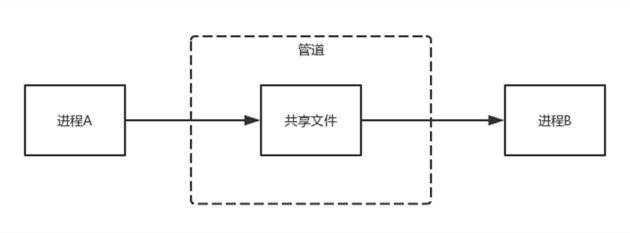

# Linux的IPC机制

## 管道

管道是Linux由Unix那里继承过来的进程间的通信机制，它是Unix早期的一个重要通信机制。

管道的主要思想是，在内存中创建一个共享文件，从而使通信双方利用这个共享文件来传递信息。

这个共享文件比较特殊，它不属于文件系统并且只存在于内存中。

另外还有一点，管道采用的是半双工通信方式的，数据只能在一个方向上流动。

## 信号

信号是软件层次上对中断机制的一种模拟，是一种异步通信方式，进程不必通过任何操作来等待信号的到达。

信号可以在用户空间进程和内核之间直接交互，内核可以利用信号来通知用户空间的进程发生了哪些系统事件。

信号不适用于信息交换，比较适用于进程中断控制。

## 信号量

信号量是一个计数器，用来控制多个进程对共享资源的访问。

它常作为一种锁机制，防止某进程正在访问共享资源时，其他进程也访问该资源。

主要作为进程间以及同一进程内不同线程之间的同步手段。

## 消息队列

消息队列是消息的链表，具有特定的格式，存放在内存中并由消息队列标识符标识，并且允许一个或多个进程向它写入与读取消息。

信息会复制两次，因此对于频繁或者信息量大的通信不宜使用消息队列。

## 共享内存

多个进程可以直接读写的一块内存空间，是针对其他通信机制运行效率较低而设计的。

为了在多个进程间交换信息，内核专门留出了一块内存区，可以由需要访问的进程将其映射到自己的私有地址空间。

进程就可以直接读写这一块内存而不需要进行数据的拷贝，从而大大的提高效率。

## 套接字
套接字是更为基础的进程间通信机制，与其他方式不同的是，套接字可用于不同机器之间的进程间通信。