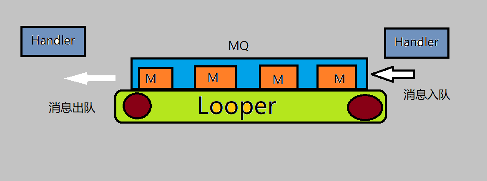

# 背景

<font color=#dea32c>**Android消息机制**</font>是Android系统中的核心技术点之一。



在此机制中，有4个角色各司其职：
1. Handler：负责消息的发送和处理。
2. Looper：负责循环从队列中取出消息交给Handler处理。
3. MessageQueue：消息队列。
4. Message：消息。

### 重点
理解从子线程发送消息（消息入队），到主线程处理消息（消息出队）的源码原理。

``` puml
skinparam ActivityBackgroundColor #eeeeee
skinparam backgroundColor #lightgrey 
skinparam shadowing false
#yellow:Handler;
-> sendXxxMessage;
#00C957:MessageQueue;
-[#blue]-> enqueueMessage 消息入队;
#ff6666 :Looper;
-[#green,dashed]-> loop() 
循环接收消息和发送消息;
#00C957:MessageQueue;
-[dotted]-> next 消息出队;
#yellow:Handler;
-[dotted]-> dispatchMessage 分发消息 
        ↓
handleMessage 处理消息;
stop
```

[参考](https://www.bilibili.com/video/BV1ma411F7tY?p=6&vd_source=bcad053415c86e8df523e0a0351e604a)

### Handler机制与App启动
``` puml
skinparam ActivityBackgroundColor #eeeeee
skinparam backgroundColor #lightgrey 
skinparam shadowing false
:Launcher(桌面app);
-> 点击某个应用图标;
:Zygote进程;
-> fork一个进程;
:App进程;
```

