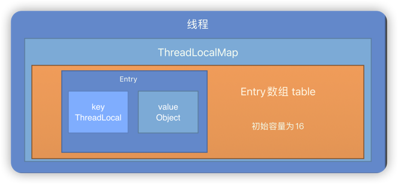
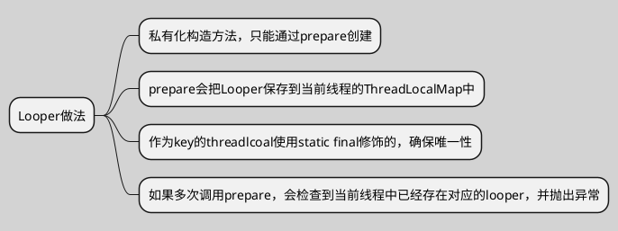

# Handler机制流程图

``` puml
skinparam ActivityBackgroundColor #eeeeee
skinparam backgroundColor #lightgrey 
skinparam shadowing false
title 简易流程图\n
#yellow:Handler;
-> sendXxxMessage;
#00C957:MessageQueue;
-[#blue]-> enqueueMessage 消息入队;
#ff6666 :Looper;
-[#green,dashed]-> loop() 
循环接收消息和发送消息;
#00C957:MessageQueue;
-[dotted]-> next 消息出队;
#yellow:Handler;
-[dotted]-> dispatchMessage 分发消息 
        ↓
handleMessage 处理消息;
stop
```

``` puml
skinparam ActivityBackgroundColor #eeeeee
skinparam backgroundColor #lightgrey 
skinparam shadowing false
|#ff6666|Handler\n|
:sendXxxMessage;
|#66ff66|MessageQueue|
:enqueueMessage🔐;
|#9999ff|Looper|
:loop;
|MessageQueue|
:next🔐;
|Handler\n|
:dispatchMessage;
:handleMessage;
```

## 保证一个线程中只能有一个Looper



