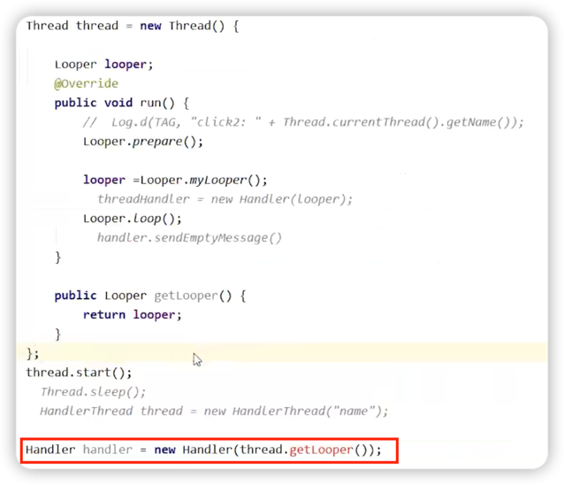

# 子线程中如何创建Handler
1. 可以在子线程中直接new Handler()吗
2. 在子线程使用Handler错误演示
3. HandlerThread内部原理
4. HandlerThread简单使用

## 可以在子线程中直接new Handler()吗
main()中之所以可以直接new Handler()，是因为ActivityThread已经为主线程创建了Looper。

### 结论
不行，必须在子线程中调用Looper.prepare()创建looper。

``` java
public Handler() {
    this(null, false);
}
    
public Handler(@Nullable Callback callback, boolean async) {
    // ...
    // 获取当前线程的looper
    mLooper = Looper.myLooper();
    if (mLooper == null) {
        // 如果获取不到则抛出异常
        throw new RuntimeException(
            "Can't create handler inside thread " + Thread.currentThread()
                    + " that has not called Looper.prepare()");
    }
    // ...
}
```

## 在子线程使用Handler错误演示

下面这种写法存在线程安全问题，因为thread.getLooper()有可能返回null。



## HandlerThread内部原理

通过wait/notify机制，保证getLooper()一定在在Looper创建之后执行。

``` java
@Override
public void run() {
    mTid = Process.myTid();
    // 创建looper
    Looper.prepare();
    synchronized (this) {
        // 将当前线程的looper赋值给变量mLooper
        mLooper = Looper.myLooper();
        // 通知唤醒getLooper()
        notifyAll();
    }
    Process.setThreadPriority(mPriority);
    onLooperPrepared();
    // 启动looper
    Looper.loop();
    mTid = -1;
}
```

``` java
public Looper getLooper() {
    
    boolean wasInterrupted = false;
    
    // 如果线程已经被启动了，等待looper创建完成
    synchronized (this) {
        while (isAlive() && mLooper == null) {
            try {
                wait();
            } catch (InterruptedException e) {
                wasInterrupted = true;
            }
        }
    }

    if (wasInterrupted) {
        Thread.currentThread().interrupt();
    }

    return mLooper;
}
```

## HandlerThread简单使用

``` kotlin
// 创建并启动一个HandlerThread
val handlerThread = HandlerThread("test")
handlerThread.start()

// 创建一个handler，传入handlerThread的looper
val handler = Handler(handlerThread.looper, object : Handler.Callback {
    override fun handleMessage(msg: Message): Boolean {
        // handleMessage执行在子线程
        if(msg.what == 1){
            Log.d(TAG, "current thread is "+Thread.currentThread().name)
            Log.d(TAG, "obj is ${msg.obj}")
        }
        return true
    }
})

// 向子线程test发送消息
handler.sendMessage(Message.obtain().apply {
    what = 1
    obj = "信息"
})
```
