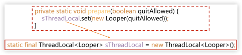
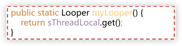
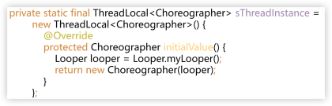
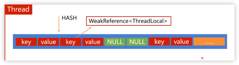
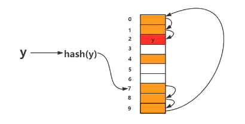

# ThreadLocal的原理

1. ThreadLocal的适用于什么场景？
2. ThreadLocal的使用方式是怎样的？
3. ThreadLocal的实现原理是怎样的？

*** 

## <font color=orange>**场景**</font>

### <font color=#33a3dc>Looper</font>





### <font color=#33a3dc>Choreographer</font>

意为<font color=#66ff66>**编舞者**</font>。



***

## <font color=orange>**原理**</font>



### <font color=#33a3dc>如何解决Hash冲突</font>

通过<font color=#66ff66>**开放寻址法**</font>解决。

若出现散列冲突，就重新探测一个空闲位置，将其插入。


> 当往散列表中插入数据时，如果某个数据经过散列函数散列之后，存储位置已经被占用了，就从当前位置开始，依次往后查找，看是否有空闲位置，直到找到为止。

> HashMap则是通过<font color=#66ff66>**链表法**</font>来解决。

``` java
private void set(ThreadLocal<?> key, Object value) {
    Entry[] tab = table;
    int len = tab.length;
    int i = key.threadLocalHashCode & (len-1);

    for (Entry e = tab[i];
         e != null;
         e = tab[i = nextIndex(i, len)]) {
        ThreadLocal<?> k = e.get();

        if (k == key) {
            e.value = value;
            return;
        }

        if (k == null) {
            replaceStaleEntry(key, value, i);
            return;
        }
    }

    tab[i] = new Entry(key, value);
    int sz = ++size;
    if (!cleanSomeSlots(i, sz) && sz >= threshold)
        rehash();
}
```