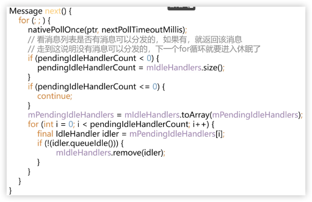

# IdleHandler的原理

#### MessageQueue.java

``` java
/**
 * 发现当一个线程正在阻塞等待更多的消息时，触发的回调接口
 * Callback interface for discovering when a thread is going to block
 * waiting for more messages.
 */
public static interface IdleHandler {
    /**
     * 队列空闲
     * 1. 消息队列中没有消息
     * 2. 消息队列中的消息没到触发时间
     * Called when the message queue has run out of messages and will now
     * wait for more.  Return true to keep your idle handler active, false
     * to have it removed.  This may be called if there are still messages
     * pending in the queue, but they are all scheduled to be dispatched
     * after the current time.
     */
    boolean queueIdle();
}
```

``` java
/**
 * Add a new {@link IdleHandler} to this message queue.  This may be
 * removed automatically for you by returning false from
 * {@link IdleHandler#queueIdle IdleHandler.queueIdle()} when it is
 * invoked, or explicitly removing it with {@link #removeIdleHandler}.
 *
 * <p>This method is safe to call from any thread.
 *
 * @param handler The IdleHandler to be added.
 */
public void addIdleHandler(@NonNull IdleHandler handler) {
    if (handler == null) {
        throw new NullPointerException("Can't add a null IdleHandler");
    }
    synchronized (this) {
        mIdleHandlers.add(handler);
    }
}
```

