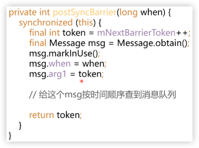

# 消息屏障

## 消息的分类

1. 普通消息：通常使用的都是普通消息。
2. 屏障消息：在消息队列中插入一个屏障，在屏障之后的所有普通消息都会被挡着，不能被处理。
3. 异步消息：不会被屏障阻挡的消息。

## 屏障作用

为了确保异步消息的优先级，设置了屏障后，只能处理其后的异步消息，同步消息会被挡住，除非撤销屏障。

在发送异步消时，向消息队列插入同步屏障对象，消息队列会返回同步屏障的token，

此时消息队列中的同步消息都会被暂停处理，优先执行异步消息处理，等异步消息处理完成再通过消息队列移除token对应的同步屏障，消息队列继续之前暂停的同步消息处理。

## 发送消息屏障

通过MessageQueue的postSyncBarrier方法插入到消息队列。

1. 消息屏障没有target。
2. 消息屏障带有时间戳(when)，只影响到时间后面的消息。
3. 消息队列可以插入多个消息屏障。
4. 插入屏障后，会返回一个token，用于取消屏障时查找到对应的屏障。

## 删除消息屏障

