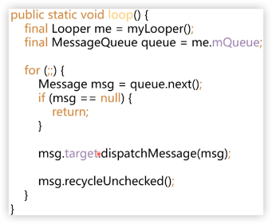

# 说说Android线程间消息传递机制

1. 消息循环过程是怎样的？
2. 消息是怎么发送的？
3. 消息是怎么处理的？

## 消息循环过程是怎样的



1. 获取Looper对象me
2. 获取MessageQueue
3. 循环
    1. next消息出队（可能阻塞）
    2. 如果消息为null，退出loop循环
    3. 分发消息
    4. 回收消息

### 消息是如何出队的？

``` java
 Message next() {
     final long ptr = mPtr;
     if (ptr == 0) {
         return null;
     }

     int pendingIdleHandlerCount = -1; // -1 only during first iteration
     int nextPollTimeoutMillis = 0;
     for (;;) {
         if (nextPollTimeoutMillis != 0) {
             Binder.flushPendingCommands();
         }

         nativePollOnce(ptr, nextPollTimeoutMillis);

         synchronized (this) {
             // Try to retrieve the next message.  Return if found.
             final long now = SystemClock.uptimeMillis();
             Message prevMsg = null;
             Message msg = mMessages;
             if (msg != null && msg.target == null) {
                 // Stalled by a barrier.  Find the next asynchronous message in the queue.
                 do {
                     prevMsg = msg;
                     msg = msg.next;
                 } while (msg != null && !msg.isAsynchronous());
             }
             if (msg != null) {
                 if (now < msg.when) {
                     // Next message is not ready.  Set a timeout to wake up when it is ready.
                     nextPollTimeoutMillis = (int) Math.min(msg.when - now, Integer.MAX_VALUE);
                 } else {
                     // Got a message.
                     mBlocked = false;
                     if (prevMsg != null) {
                         prevMsg.next = msg.next;
                     } else {
                         mMessages = msg.next;
                     }
                     msg.next = null;
                     if (DEBUG) Log.v(TAG, "Returning message: " + msg);
                     msg.markInUse();
                     return msg;
                 }
             } else {
                 // No more messages.
                 nextPollTimeoutMillis = -1;
             }

             // Process the quit message now that all pending messages have been handled.
             if (mQuitting) {
                 dispose();
                 return null;
             }

             // If first time idle, then get the number of idlers to run.
             // Idle handles only run if the queue is empty or if the first message
             // in the queue (possibly a barrier) is due to be handled in the future.
             if (pendingIdleHandlerCount < 0
                     && (mMessages == null || now < mMessages.when)) {
                 pendingIdleHandlerCount = mIdleHandlers.size();
             }
             if (pendingIdleHandlerCount <= 0) {
                 // No idle handlers to run.  Loop and wait some more.
                 mBlocked = true;
                 continue;
             }

             if (mPendingIdleHandlers == null) {
                 mPendingIdleHandlers = new IdleHandler[Math.max(pendingIdleHandlerCount, 4)];
             }
             mPendingIdleHandlers = mIdleHandlers.toArray(mPendingIdleHandlers);
         }

         // Run the idle handlers.
         // We only ever reach this code block during the first iteration.
         for (int i = 0; i < pendingIdleHandlerCount; i++) {
             final IdleHandler idler = mPendingIdleHandlers[i];
             mPendingIdleHandlers[i] = null; // release the reference to the handler

             boolean keep = false;
             try {
                 keep = idler.queueIdle();
             } catch (Throwable t) {
                 Log.wtf(TAG, "IdleHandler threw exception", t);
             }

             if (!keep) {
                 synchronized (this) {
                     mIdleHandlers.remove(idler);
                 }
             }
         }

         // Reset the idle handler count to 0 so we do not run them again.
         pendingIdleHandlerCount = 0;

         // While calling an idle handler, a new message could have been delivered
         // so go back and look again for a pending message without waiting.
         nextPollTimeoutMillis = 0;
     }
 }
```

### 消息是如何分发的？

``` java
public void dispatchMessage(@NonNull Message msg) {
    if (msg.callback != null) {
        // 优先处理Message的Callback
        handleCallback(msg);
    } else {
        if (mCallback != null) {
            // 后优先处理Handler的Callback
            if (mCallback.handleMessage(msg)) {
                return;
            }
        }
        // 没有Callback则处理msg
        handleMessage(msg);
    }
}
```


