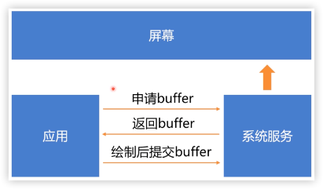

# UI刷新机制

1. 丢帧一般是什么原因引起的？
   > 主线程耗时操作
2. Android刷新频率60帧/秒，每隔16ms调onDraw绘制一次？
   >
3. onDraw完之后屏幕会马上刷新么？
4. 如果界面没有重绘，还会每隔16ms刷新屏幕么？
5. 如果在屏幕快要刷新的时候才去onDraw绘制会丢帧么？

## 双缓存

1. 缓存1用来显示数据。
2. 缓存2用来写数据。
3. 缓存1读取完后，交换缓存1和缓存2。

## 刷新卡顿原理

1. vsync：固定频率的脉冲信号。
2. 屏幕收到vsync信号后，就会从缓冲区取一帧信号显示。
3. 绘制，由应用端发起。

1. 如果每一帧控制在16ms以内，就可以最大程度避免延迟绘制。
2. choreographer类，控制绘制在下一个vsync信号到来时触发。

### 连续调用requestLayout，会被全部执行吗？

不会，mTraversalScheduled控制了必须要等下一次vsync信号发送时才会执行scheduleTraversals。

### Callback是如何进入到Choreographer中的

## 总结流程

