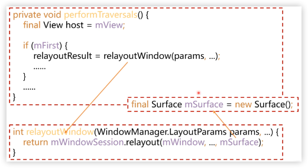
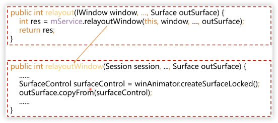
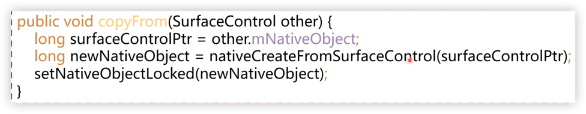
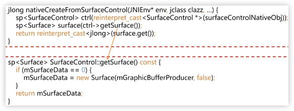

# surface跨进程传输原理

## 🤔 思考题

1. 怎么理解surface，它是一块buffer吗？
   > surface不是buffer，它包含了一个能够生成buffer的binder对象，就是GraphicBufferProducer。
   >
   > > surface类似于canvas，就是一块画布, surface绘制完成后，需要跨进程提交给系统去显示。
2. 如果是，surface跨进程传递怎么带上这个buffer?
3. 如果不是，那surface跟buffer又是什么关系？
4. surface到底是怎么跨进程传递的？
   > SurfaceControl类，包含了GraphicBufferProducer，可以创建Surface，跨进程返回应用。``

## Surface类

``` java
package android.view;

/**
 * 屏幕合成程序正在管理的原始缓冲区的句柄。
 */
public class Surface implements Parcelable {}
```

``` java
@Override
public void writeToParcel(Parcel dest, int flags) {
    // ...
    synchronized (mLock) {
        dest.writeString(mName);
        dest.writeInt(mIsSingleBuffered ? 1 : 0);
        nativeWriteToParcel(mNativeObject, dest);
    }
    // ...
}
```

``` java
public void readFromParcel(Parcel source) {
    synchronized (mLock) {
        mName = source.readString();
        mIsSingleBuffered = source.readInt() != 0;
        setNativeObjectLocked(nativeReadFromParcel(mNativeObject, source));
    }
}
```

## Activity的surface是怎么跨进程传递的？









## 总结

1. surface本质是GraphicBufferProducer，而不是buffer
2. surface跨进程传递，本质就是GraphicBufferProducer的传递