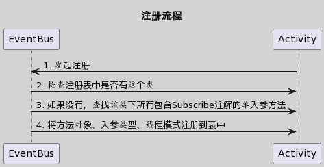

## MyEventBus知识点总结





#### 1. DCL单例

```kotlin
// DCL单例
companion object {
    // 声明一个类实例，添加Volatile注解
    @Volatile
    private var instance: MyEventBus? = null

    fun getDefault(): MyEventBus {
        // 第一次判空
        if (instance == null) {
            // 第二次判空，在同步代码块中执行
            synchronized(MyEventBus.javaClass) {
                if (instance == null) {
                    // 经过两次判空后才初始化
                    instance = MyEventBus()
                }
            }
        }
        // 返回实例
        return instance!!
    }
}
```

### 2. 使用Handler保证代码在主线程中执行

```kotlin
// 通过主线程的Looper来创建Handler
val handler = Handler(Looper.getMainLooper())

handler.post {
    // 相关代码
}
```

### 3. 使用一个HashMap来管理所有的注册者和对应的注册信息

```kotlin
val cacheMap: HashMap<Any, List<SubscribeMethod>?> = HashMap()
```

### 4. 如何注册一个类

    本质是将这个类中所有符合条件的方法信息注册到对应的List<SubscribeMethod>中去。

#### 关键方法

* declaredMethods：获取类的所有独有方法，不包含父类方法。
* method.getAnnotation(Subscribe::class.java)：获取方法的指定注解。
* method.parameterTypes：获取方法的形参列表。

```kotlin
// 获取当前类包含的所有public，protected，default，private方法
// declaredMethods不包含从父类继承来的方法
clazz.declaredMethods.forEach { method ->
    // 查找包含Subscribe注解的方法
    method.getAnnotation(Subscribe::class.java)?.let { subscribe ->
        // 判断方法入参是否只有一个
        if (method.parameterTypes.size == 1) {
            val threadMode = subscribe.threadMode
            val subscribeMethod = SubscribeMethod(
                method,
                method.parameterTypes[0].name, threadMode
            )
            list.add(subscribeMethod)
        }
    }
}
```

### 5. 如何判断消息的类型与方法的入参类型是相一致的？

```kotlin
// 通过全类名进行判断
subscribeMethod.messageType == message.javaClass.name
```

### 6. 如何通过反射来调用一个方法？

```kotlin
// 获取注解信息中的Method对象
val method = subscribeMethod.method
// 设置方法可以访问
method.isAccessible = true
// 调用该注册方法
// registrant是方法所属的类对象
// message是方法的入参
method.invoke(registrant, message)
```
