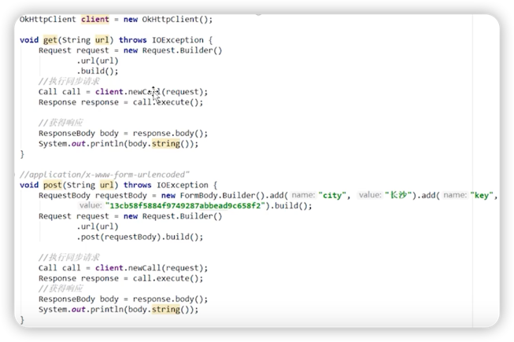
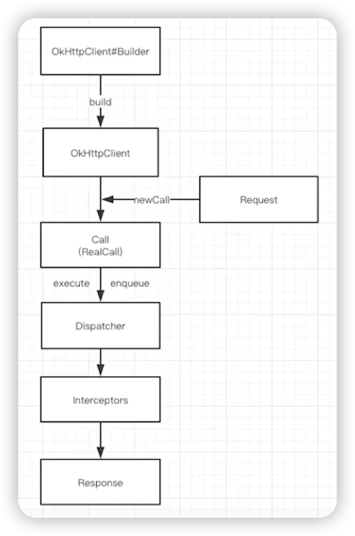

# OKHTTP使用流程

***
### GET 和 POST 代码样例

从上面代码可以看出：

请求过程中最少只需要接触 **OkHttpClient、Request、Call、Response**。

但是在Call执行Request获取Response的过程中，有两个非常重要的组件：**分发器**和**拦截器**。

>分发器：内部维护队列和线程池，完成**请求调配**。

>拦截器：完成整个**请求过程**。

***

**拦截器**的本质是完成**HTTP请求**流程，以及其他优化性的工作。

> ###回顾：HTTP请求过程
> 1. **DNS解析**，将域名解析为IP地址。
> 2. 根据IP地址**建立TCP连接**（🤝x3），获取到**Socket**对象（Socket本质是对TCP的封装）。
> 3. 利用Socket的输出流写**响应报文**，发送回客户端。
> 

### 角色关系

| 被比喻对象 | 比喻对象 | 作用 |
| --- | --- | --- |
| OkHttpClient | 邮局 | 创建和发送HTTP请求 |
| Request | 信件 | 包含URL、请求头、请求体等信息，表示一个HTTP请求 |
| Response | 回件 | 包含状态码、响应头、响应体等信息，表示一个HTTP响应 |
| Call | 发件人 | 将Request交付给OkHttpClient进行请求，并将Response返回 |
| Callback | 收件人      | 处理异步请求的响应结果 |
| Interceptor | 邮局工人 | 在请求过程中对请求或响应进行修改或添加额外的信息 |
| FormBody | 信纸 | 用于传送表单提交参数 |
| MultipartBody | 附件 | 用于上传文件或其他数据的请求 |

## 异步请求流程

当使用OkHttp库发起异步请求时，可以通过调用`Call.enqueue()`方法来执行该请求。下面是从`enqueue()`方法到获取响应的源码分析过程：

1. 当调用`Call.enqueue()`方法时，OkHttp会创建一个新的`RealCall`对象，然后将其加入到`Dispatcher`中进行调度，最终通过线程池来执行任务。

2. `RealCall`对象会调用`getResponseWithInterceptorChain()`方法来获取响应。在这个方法中，它会依次调用一系列拦截器（包括应用拦截器和网络拦截器）的拦截方法，来处理该请求以及响应数据，并返回最终的响应结果。

3. 当响应结果准备好后，`RealCall`对象会回调`Callback`接口中的`onResponse()`方法，将响应结果传递给上层业务逻辑进行处理。

总之，在使用OkHttp进行异步请求时，主要是通过`Call.enqueue()`方法来提交请求，OkHttp底层会通过`RealCall`对象和拦截器链来处理请求和响应，并回调`Callback`接口中的方法来返回最终结果，从而实现了请求与响应的异步处理。

### 关键词
OkHttp、异步请求、enqueue()方法、RealCall、拦截器链、Callback接口。

| 被比喻对象 | 比喻对象 | 作用 |
| --- | --- | --- |
| OkHttp | 一个工厂 | 生产`RealCall`对象 |
| 异步请求 | 一道加工工艺 | 将`RealCall`对象加入调度队列进行异步处理 |
| enqueue()方法 | 加工车间 | 负责将请求放入线程池中执行 |
| RealCall | 半成品原材料 | 包含了请求和响应数据，需要进行字段转换、内容解析等操作 |
| 拦截器链 | 流水线 | 由多个拦截器组成的链式流程，对请求和响应进行加工处理 |
| Callback接口 | 组装线 | 接收最终的响应结果，进行业务逻辑处理 |

