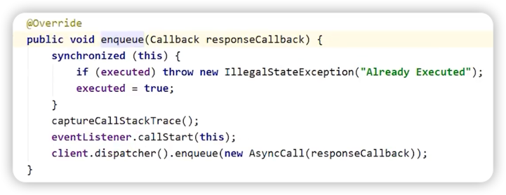

# OKHTTP分发器原理

| 被比喻对象 | 比喻对象 | 作用 |
| --- | --- | --- |
| OkHttp | 快递公司 | 提供网络请求的传输服务 |
| Dispatcher | 快递调度中心 | 管理和调度快递流程 |
| 线程池 | 快递员们 | 根据调度中心的指令负责具体的快递送达 |
| Call | 快递邮寄订单 | 具体要求某个包裹被寄送到目的地 |
| AsyncCall | 快递订单单号 | 将邮寄订单和快递员进行对应 |
| runningAsyncCalls | 已经送达的包裹 | 正在被派送员递送到收件人手中的包裹 |
| readyAsyncCalls | 即将开始送达的包裹 | 等待派送员配送的包裹 |

比喻：OkHttp就像是一个快递公司，提供网络请求的传输服务。`Dispatcher`则类似于快递调度中心，管理和调度快递流程，并将请求分配给线程池中的线程来处理。线程池则类似于具体的快递员，根据调度中心的指令负责具体的快递送达。每个`Call`对象相当于一份快递邮寄订单，具体要求某个包裹被寄送到目的地。而每个`AsyncCall`对象就像是一个快递订单单号，将邮寄订单和快递员进行对应。`runningAsyncCalls`则类似于已经送达的包裹，正在被派送员递送到收件人手中的包裹；`readyAsyncCalls`则相当于即将开始送达的包裹，等待派送员配送的包裹。通过合理地管理和调度这些资源，就可以高效地完成所有的请求处理工作，最终实现网络传输的可靠性和高效性。

OkHttp使用了Dispatcher类来管理和控制请求任务的分发。Dispatcher类底层通过维护一个线程池和一个任务队列来实现对异步请求的调度。

具体地说，Dispatcher会维护两个队列：一个runningAsyncCalls队列和一个readyAsyncCalls队列。当我们调用Call.enqueue()方法提交一个异步请求时，该请求会封装成一个AsyncCall对象，并加入到Dispatcher的等待队列中（即readyAsyncCalls队列）。

Dispatcher会不断地从等待队列中取出请求，并判断当前正在执行的请求数量是否超过最大限制（默认为64）。如果没有超过限制，则会将该请求加入到正在运行的队列（即runningAsyncCalls队列），并通过线程池来执行它。

当请求完成后，Dispatcher会将其从运行队列中移除，然后再从等待队列中取出下一个请求进行处理，直到所有请求都被处理完成。

需要注意的是，OkHttp还支持同时发送多个请求，并且可以通过配置来控制最大请求数、最大路由数等参数信息。因此，在高并发场景下，合理地控制请求任务的分发，可以有效地提升应用的性能。

必背关键词
1. RealCall：执行请求/响应
2. Dispatcher：分发任务
3. AsyncCall
4. runningAsyncCalls
5. readyAsyncCalls

### 分发器异步请求流程总结
1. **OkHttpClient**调用**newCall**后会生成一个**RealCall**。
2. 通过**RealCall**来执行**enqueue**方法发起异步请求，内部会调用**Dispatcher**的**enqueue**，传入一个**AysncCall**对象。
3. **Dispatcher**会根据正在执行的请求数和正在执行的同域名请求数来决定将**AysncCall**放入**runningAysncCalls**还是**ReadyAsyncCalls**。
4. 如果放入**runningAsyncCalls**，则会由线程池来调度执行。
5. 如果放入**readyAysncCalls**，则会在请求完成后由**Dispatcher**再次尝试放入**runningAsyncCalls**中。
   

***

## newCall方法创建RealCall
RealCall实现了Call接口，创建过程如下所示：

***

## enqueue异步请求源码解析
> ### **RealCall.enqueue()**
> 
> ### 代码分析
> 1. 在同步代码块中判断请求是否已被执行，是则抛出异常，防止重复请求。
> 2. eventListener执行监听，例如监听请求开始，DNS解析开始，DNS解析结束，连接开始等等。
> 3. **核心代码。调用分发器的enqueue方法，传入了AsyncCall(封装了请求信息)。**

> ### **Dispatcher.enqueue**
>
>
> 
> ### 代码分析
> ***
> ① 判断正在执行的异步请求个数不大于64  
> 
> 
> ***
> ② 限制同一个域名的请求数不大于5  
> 
> 
> ***
> ③ 如果条件成立，则将AsyncCall放入runningAysncCalls，让线程池去执行。 
> 
> >🤔 线程池的execute做了什么？
> 
> 
> 
> >🤔 finished方法做了什么
> 
> 
> 
> 在promoteCalls中将ready任务放入running中执行
> 
> 
> 
> ***
> ④ 如果条件不成立，则放入runningSyncCalls。
> 
> **每完成一次请求，分发器会尝试将ready中的任务放入到running中去执行**。
> 
> > #### Dispatcher中的三个数组双端队列：  
> >  
> **runningAysncCalls**：正在执行的异步任务队列。  
> **readAysncCalls**：准备执行的异步任务队列。  
> **runningSyncCalls**：正在执行的同步任务队列。
> 
> 
> 

***

