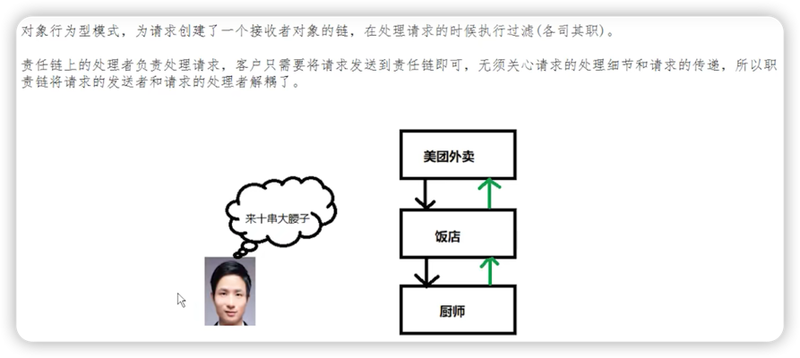
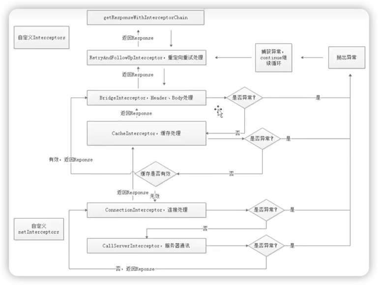

# 拦截器

## 复习
经过"分发器"篇章的学习，了解到：
1. AsyncCall是提交给线程池执行的Runnable任务。
2. 完成请求获取响应的流程，是在AsyncCall的execute方法中。

``` java
// AsyncCall.java
@Override 
protected void execute() {
    // ...
    try {
        // 通过拦截器完成请求，获得Response
        Response response = getResponseWithInterceptorChain();
        // 回调成功
        responseCallback.onResponse(RealCall.this, response);
    }
    // 如果发生异常在回调失败
    // ...
}
```

***

## getResponseWithInterceptorChain()

1. 方法名一定要牢记！（利用拦截器链获取响应）
2. 该方法用到了"责任链模式"（解耦请求的发起者和处理者，发起者只需得到结果，无需关心过程）

``` java
对象行为型模式，为请求创建了一个接收者对象的链，在处理请求的时候执行过滤(各司其职）。
责任链上的处理者负责处理请求，客户只需要将请求发送到责任链即可，无须关心请求的处理细节和请求的传递，
所以责任链将请求的发送者和请求的处理者解耦了。
```

> 

#### 关于拦截器链

拦截器链，也就是责任链，是一个U形链条，

1. 向下的传递过程决定了有哪些处理者。
2. 向上的传递过程才是处理结果的传递。

``` java
Response getResponseWithInterceptorChain() throws IOException {
    // Build a full stack of interceptors.
    List<Interceptor> interceptors = new ArrayList<>();
    // 用户自定义的拦截器
    interceptors.addAll(client.interceptors());
    // 重试重定向拦截器
    interceptors.add(new RetryAndFollowUpInterceptor(client));
    // 桥接拦截器
    interceptors.add(new BridgeInterceptor(client.cookieJar()));
    // 缓存拦截器
    interceptors.add(new CacheInterceptor(client.internalCache()));
    // 连接拦截器
    interceptors.add(new ConnectInterceptor(client));
    if (!forWebSocket) {
      interceptors.addAll(client.networkInterceptors());
    }
    // 请求服务拦截器
    interceptors.add(new CallServerInterceptor(forWebSocket));

    Interceptor.Chain chain = new RealInterceptorChain(interceptors, transmitter, null, 0,
        originalRequest, this, client.connectTimeoutMillis(),
        client.readTimeoutMillis(), client.writeTimeoutMillis());

    boolean calledNoMoreExchanges = false;
    try {
      // 调用proceed方法会依次执行各个拦截器的intercept方法
      // 最终获得response
      Response response = chain.proceed(originalRequest);
      if (transmitter.isCanceled()) {
        closeQuietly(response);
        throw new IOException("Canceled");
      }
      return response;
    } catch (IOException e) {
      calledNoMoreExchanges = true;
      throw transmitter.noMoreExchanges(e);
    } finally {
      if (!calledNoMoreExchanges) {
        transmitter.noMoreExchanges(null);
      }
    }
}
```

### 各个拦截器的作用

1. 重试拦截器在交出(交给下一个拦截器)之前，负责判断用户是否取消了请求；在获得了结果之后 会根据响应码判断是否需要重定向，如果满足条件那么就会重启执行所有拦截器。
2. 桥接拦截器在交出之前，负责将HTTP协议必备的请求头加入其中(如：Host)并添加一些默认的 行为(如：GZIP压缩)；在获得了结果后，调用保存cookie接口并解析GZIP数据。
3. 缓存拦截器顾名思义，交出之前读取并判断是否使用缓存；获得结果后判断是否缓存。
4. 连接拦截器在交出之前，负责找到或者新建一个连接，并获得对应的socket流；在获得结果后 不进行额外的处理。
5. 请求服务器拦截器进行真正的与服务器的通信，向服务器发送数据，解析读取的响应数据。

### 拦截器链工作流程图




