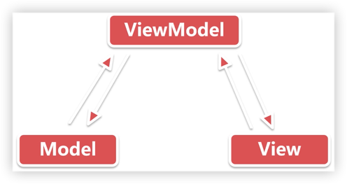

# MVVM简介



Model-View-ViewModel 的简写。

在MVP的基础上实现了数据视图的绑定(Data Binding），

1. 当数据变化时，视图会自动更新；
2. 当视图变化时，数据也会自动更新；

> M：Model，数据层。
>
> V：View，视图层。
>
> VM：ViewModel，关联层。
***

## Databinding

谷歌官方发布的实现数据绑定的框架（实现数据与视图的双向绑定)，帮助在安卓中更好的实现MVVM模式。

### 使用步骤

1. 在app的build.gradle文件的android节点下添加：

```groovy
dataBinding {
    enable = true
}
```

2. 修改布局文件为databinding布局

```xml
<?xml version="1.0" encoding="utf-8"?>
<layout xmlns:android="http://schemas.android.com/apk/res/android">

    <data class=".MvvmFragmentBinding">
        <!--  指定ViewModel  -->
        <variable
            name="user"
            type="com.yxd.knowledge.design.mvvm.code.User" />
        <!--  导入类  -->
        <import type="android.view.View"/>

    </data>

    <LinearLayout
        android:layout_width="match_parent"
        android:layout_height="match_parent"
        android:orientation="vertical">
        <!-- ... -->
    </LinearLayout>
</layout>
```

3. 在Activity或Fragment中操作Binding对象

``` kotlin
val binding = MvvmFragmentBinding.inflate(inflater, container, false)
// 创建一个Model
val user = User("消失的光芒", "123456")
// 设置Model
binding.user = user
binding.btnChange.setOnClickListener {
    // 改变Model
    user.name = "未来"
}
```


