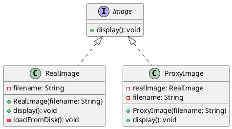

# 代理模式java

下面是一个使用Java实现代理模式的简单demo示例。这个demo定义了一个`Image`接口，包含加载和显示图片的方法。然后，实现了具体的`RealImage`类，用于真正加载和显示图片；同时还实现了代理类`ProxyImage`，它在必要时才创建`RealImage`对象，从而实现延迟加载。



首先定义`Image`接口：

```java
public interface Image {
    void display();
}
```

然后实现`RealImage`类，用于真正加载和显示图片：

```java
public class RealImage implements Image {
    private String filename;

    public RealImage(String filename) {
        this.filename = filename;
        loadFromDisk();
    }

    @Override
    public void display() {
        System.out.println("Displaying " + filename);
    }

    private void loadFromDisk() {
        System.out.println("Loading " + filename + " from disk");
    }
}
```

最后实现代理类`ProxyImage`，它在必要时才创建`RealImage`对象，从而实现延迟加载：

```java
public class ProxyImage implements Image {
    private RealImage realImage;
    private String filename;

    public ProxyImage(String filename) {
        this.filename = filename;
    }

    @Override
    public void display() {
        if (realImage == null) {
            realImage = new RealImage(filename);
        }
        realImage.display();
    }
}
```

在使用代理模式时，只需要通过代理类来访问`Image`对象即可：

```java
public class ProxyDemo {
    public static void main(String[] args) {
        Image image = new ProxyImage("test.jpg");

        // 图片未被加载，现在将真正执行加载操作
        image.display();

        // 图片已经被加载，不需要再次加载
        image.display();
    }
}
```

当运行程序时，控制台中将输出以下内容：

```
Loading test.jpg from disk
Displaying test.jpg
Displaying test.jpg
```

上述示例展示了如何使用代理模式来延迟对象的创建和初始化过程。通过代理类，我们可以按需地创建和访问真实的对象，从而实现更加灵活和高效的代码。

## 总结

1. 代理类和被代理类要实现同一个接口，保证核心方法一致。
2. 代理类持有被代理类的引用。
3. 代理类控制着被代理类的访问权限和资源分配等因素。

以上代码中使用了代理模式，主要体现在以下几个方面：

1. 定义了一个抽象的`Image`接口，表示图片对象应该具有的操作。
2. 实现了一个具体的`RealImage`类，用于真正加载和显示图片。它实现了`Image`接口，并包含了一些比较耗时的初始化方法（例如从磁盘上读取图片），以此来模拟真实情况下的资源消耗。
3. 实现了一个代理类`ProxyImage`，它也实现了`Image`接口，但是并不直接负责加载和显示图片。相反，它会在必要的时候创建`RealImage`对象，并通过存储真实对象的引用来实现对其访问。这样，就可以在需要加载图片时才真正执行耗时的操作，从而避免了不必要的开销。

总之，代理模式主要用于控制对某个对象的访问，并在必要时提供额外的处理或者延迟对象的创建和初始化过程。在本例中，代理模式被用于在需要时才创建和访问`RealImage`对象，从而实现了更加高效和灵活的代码。
