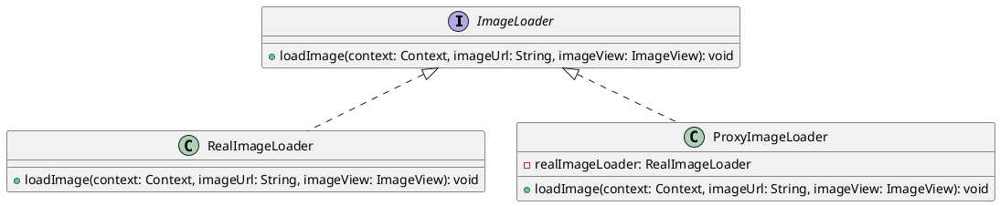

# 代理模式Android

下面是一个使用Android实现代理模式的简单demo示例。这个demo定义了一个`ImageLoader`接口，包含加载和显示图片的方法。然后，实现了具体的`RealImageLoader`类，用于真正加载和显示图片；同时还实现了代理类`ProxyImageLoader`，它在必要时才创建`RealImageLoader`对象，从而实现延迟加载。



首先定义`ImageLoader`接口：

```java
public interface ImageLoader {
    void loadImage(Context context, String imageUrl, ImageView imageView);
}
```

然后实现`RealImageLoader`类，用于真正加载和显示图片：

```java
public class RealImageLoader implements ImageLoader {

    @Override
    public void loadImage(Context context, String imageUrl, ImageView imageView) {
        // 从网络或本地磁盘加载图片
        Glide.with(context)
                .load(imageUrl)
                .into(imageView);
    }
}
```

最后实现代理类`ProxyImageLoader`，它在必要时才创建`RealImageLoader`对象，从而实现延迟加载：

```java
public class ProxyImageLoader implements ImageLoader {
    private RealImageLoader realImageLoader;
    
    @Override
    public void loadImage(Context context, String imageUrl, ImageView imageView) {
        if (realImageLoader == null) {
            realImageLoader = new RealImageLoader();
        }
        realImageLoader.loadImage(context, imageUrl, imageView);
    }
}
```

在使用代理模式时，只需要通过代理类来访问`ImageLoader`对象即可：

```java
public class ProxyDemoActivity extends AppCompatActivity {
    private static final String IMAGE_URL = "https://example.com/image.png";
    
    private ImageLoader imageLoader;
    private ImageView imageView;

    @Override
    protected void onCreate(Bundle savedInstanceState) {
        super.onCreate(savedInstanceState);
        setContentView(R.layout.activity_proxy_demo);

        // 使用代理模式加载图片
        imageLoader = new ProxyImageLoader();
        imageView = findViewById(R.id.image_view);
        imageLoader.loadImage(this, IMAGE_URL, imageView);
    }
}
```

本例中，我们使用了Glide库作为图片的真正加载和显示框架，并通过代理类`ProxyImageLoader`来管理访问控制和资源分配。当首次需要加载图片时，代理类会创建并调用`RealImageLoader`对象进行实际操作；对于后续的请求，则直接转交给已经存在的`RealImageLoader`对象进行处理。

总之，代理模式主要用于在必要的时候延迟对象的创建和初始化过程，并实现统一接口以确保代理能够完全替代被代理对象。在Android开发中，代理模式常常被用于图片等资源的加载和缓存操作中。

## 运用场景

在Android系统中，有许多系统类和第三方框架都使用了代理模式。以下是一些常见的代表：

1. `ActivityManagerService`：Android系统中负责管理应用程序生命周期的服务。它通过实现代理模式来控制Activity的启动、停止和销毁等操作，从而实现了对应用程序资源分配和管理的精细化控制。

2. `Dagger 2`：一个依赖注入框架，它通过使用代理对象来提供依赖项的注入和解析功能。具体地讲，在Dagger 2中，每个被注入的对象都会创建一个代理对象，并将依赖项传递给代理对象进行处理。

3. `OkHttp`：一个常用的HTTP客户端库，它内部使用了代理模式来管理网络请求。具体地说，OkHttp在必要时会创建并调用一个连接代理（Connection Proxy）对象来与服务器建立连接，并根据需要动态地切换连接方式和协议，从而实现更高效和可靠的网络通信。

4. `RecyclerView`：一个常用的视图布局组件库，它通过使用代理对象来管理视图的缓存和显示操作。具体地说，RecyclerView会创建并调用一个Adapter对象来控制视图的渲染和复用，从而减少不必要的内存开销和屏幕刷新时间。

总之，代理模式在Android系统中被广泛应用于各种系统类和第三方框架中，从而实现了更高效、可靠和灵活的代码处理。开发者可以通过深入了解这些代理对象的工作原理和实现机制，来提升自己的编程能力和技术水平。