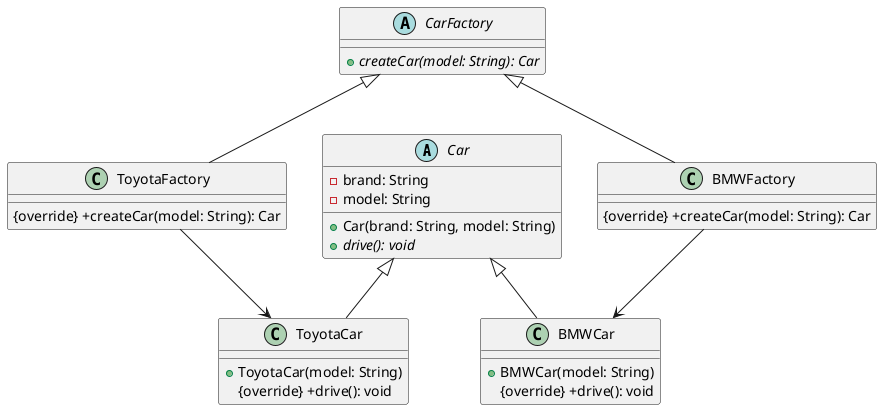

# 抽象工厂Java

以下是一个使用抽象工厂模式的 Java 示例程序，实现了不同种类的汽车和对应的工厂。假设我们有两个不同品牌的汽车：Toyota 和 BMW。

#### 总结
1. 抽象工厂+抽象产品（生产关系）
2. 具体工厂+具体产品（生产关系）



1. Car.java

```java
public abstract class Car {
    protected String brand;
    protected String model;

    public Car(String brand, String model) {
        this.brand = brand;
        this.model = model;
    }

    public abstract void drive();
}
```

2. ToyotaCar.java

```java
public class ToyotaCar extends Car {
    public ToyotaCar(String model) {
        super("Toyota", model);
    }

    @Override
    public void drive() {
        System.out.println("Driving " + brand + " " + model + "...");
    }
}
```

3. BMWCar.java

```java
public class BMWCar extends Car {
    public BMWCar(String model) {
        super("BMW", model);
    }

    @Override
    public void drive() {
        System.out.println("Driving " + brand + " " + model + "...");
    }
}
```

4. CarFactory.java

```java
public abstract class CarFactory {
    public abstract Car createCar(String model);
}
```

5. ToyotaFactory.java

```java
public class ToyotaFactory extends CarFactory {
    @Override
    public Car createCar(String model) {
        return new ToyotaCar(model);
    }
}
```

6. BMWFactory.java

```java
public class BMWFactory extends CarFactory {
    @Override
    public Car createCar(String model) {
        return new BMWCar(model);
    }
}
```

在上述代码中，我们通过定义一个抽象类 `Car` 表示汽车，其中包含了品牌和型号两个基本属性，以及一个抽象方法 `drive()` 来表示开车。`ToyotaCar` 和 `BMWCar` 是具体产品，分别继承了 `Car` 类并实现了它们各自的品牌和型号。

在工厂方面，我们定义了一个抽象工厂类 `CarFactory`，其中包含了一个抽象方法 `createCar()` 来创建汽车。`ToyotaFactory` 和 `BMWFactory` 是具体工厂，分别继承了 `CarFactory` 类并实现了它们各自的工厂方法。