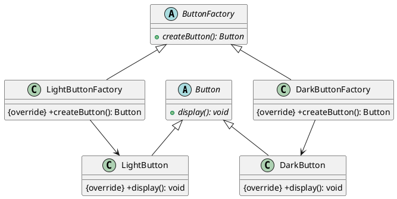
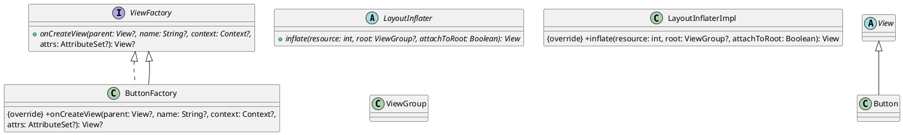
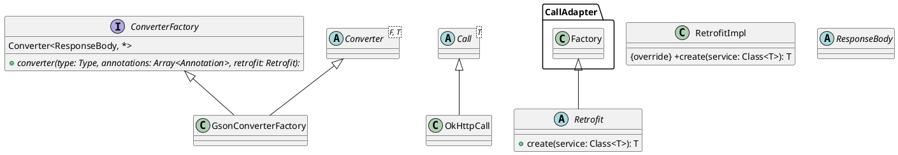
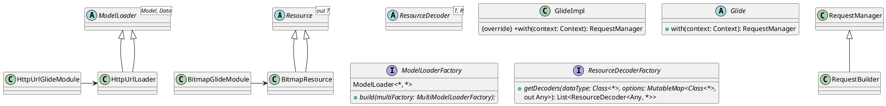

# 抽象工厂Android

以下是使用抽象工厂模式的 Android 示例程序，实现了不同种类的 Button 和对应的工厂。假设我们有两个不同风格的 Button：LightButton 和 DarkButton。



1. Button.java

```java
public abstract class Button {
    public abstract void display();
}
```

2. LightButton.java

```java
public class LightButton extends Button {
    @Override
    public void display() {
        System.out.println("This is a light button.");
    }
}
```

3. DarkButton.java

```java
public class DarkButton extends Button {
    @Override
    public void display() {
        System.out.println("This is a dark button.");
    }
}
```

4. ButtonFactory.java

```java
public abstract class ButtonFactory {
    public abstract Button createButton();
}
```

5. LightButtonFactory.java

```java
public class LightButtonFactory extends ButtonFactory {
    @Override
    public Button createButton() {
        return new LightButton();
    }
}
```

6. DarkButtonFactory.java

```java
public class DarkButtonFactory extends ButtonFactory {
    @Override
    public Button createButton() {
        return new DarkButton();
    }
}
```

在上述代码中，我们通过定义一个抽象类 `Button` 表示按钮，其中包含了一个抽象方法 `display()` 来显示按钮样式。`LightButton` 和 `DarkButton` 是具体产品，分别继承了 `Button` 类并实现了它们各自的样式。

在工厂方面，我们定义了一个抽象工厂类 `ButtonFactory`，其中包含了一个抽象方法 `createButton()` 来创建按钮。`LightButtonFactory` 和 `DarkButtonFactory` 是具体工厂，分别继承了 `ButtonFactory` 类并实现了它们各自的工厂方法。

## 使用场景

### 1. Android 源码中的 `LayoutInflater`



   在 Android 中，`LayoutInflater` 是一个用于从 XML 布局文件中实例化视图对象的系统服务。在 `LayoutInflater` 的内部实现中，使用了抽象工厂模式来创建不同类型的视图对象。例如，当需要实例化 `Button` 视图时，`LayoutInflater` 会使用 `ButtonFactory` 来创建 `Button` 实例。

### 2. 第三方框架 Retrofit



   Retrofit 是一个网络请求库，它可以通过远程调用接口来访问 Web 服务。在 Retrofit 的内部实现中，使用了抽象工厂模式来创建不同类型的网络请求。具体地，Retrofit 使用 `Converter.Factory` 接口来定义网络请求的转换器，并使用 `CallAdapter.Factory` 来定义网络请求的适配器，从而实现不同类型的网络请求。

### 3. 第三方框架 Glide



   Glide 是一个流行的图片加载库，它可以帮助我们在 Android 应用程序中更加高效地加载和显示图片。在 Glide 的内部实现中，使用了抽象工厂模式来创建不同类型的图片加载器。具体地，Glide 使用 `ModelLoader.Factory` 接口来定义图片加载器的工厂，并使用 ` ResourceDecoder.Factory` 接口来定义图片解码器的工厂，从而实现不同类型的图片加载和显示。