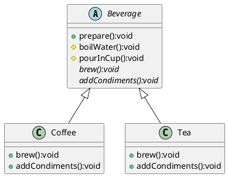

# 模板方法模式Java

以下是一个使用模板方法模式的Java示例程序，实现了一个用于制作咖啡和茶的基本算法框架：



首先定义一个抽象类`Beverage`表示饮料:

```java
public abstract class Beverage {
    /**
     * 该模式中的模板方法，定义了饮料的制作流程，并调用一些具体操作（如开水、冲泡、倒入杯子等）
     * /
    final void prepare() {
        boilWater();
        brew();
        pourInCup();
        addCondiments();
    }

    abstract void brew();

    abstract void addCondiments();

    void boilWater() {
        System.out.println("Boiling water...");
    }

    void pourInCup() {
        System.out.println("Pouring into cup...");
    }
}
```

`boilWater()` 和 `pourInCup()` 方法是通用的操作，可以在父类中直接实现；而 `brew()` 和 `addCondiments()` 方法则是需要由具体子类来实现的“原语操作”，这里只定义了方法名。

我们使用两个具体子类来分别实现咖啡和茶的制作过程：

```java
public class Coffee extends Beverage {
    @Override
    void brew() {
        System.out.println("Dripping coffee through filter...");
    }

    @Override
    void addCondiments() {
        System.out.println("Adding sugar and milk...");
    }
}

public class Tea extends Beverage {
    @Override
    void brew() {
        System.out.println("Steeping the tea...");
    }

    @Override
    void addCondiments() {
        System.out.println("Adding lemon...");
    }
}
```

在上述代码中，我们定义了一个 `Coffee` 子类和 `Tea` 子类，分别实现了 `brew()` 和 `addCondiments()` 抽象方法，以定制自己的操作流程。

最后，在主函数中，我们使用抽象父类来创建具体实例，并调用模板方法即可：

```java
public class Main {
    public static void main(String[] args) {
        Beverage coffee = new Coffee();
        Beverage tea = new Tea();

        System.out.println("\nMaking coffee...");
        coffee.prepare();

        System.out.println("\nMaking tea...");
        tea.prepare();
    }
}
```

上述代码中，我们先创建了一个`Coffee`实例和一个`Tea`实例，并调用它们的`prepare()`方法。由于这两个子类都继承了 `Beverage` 父类，并对其原语操作进行了重写，因此在执行 `prepare()` 方法时，会按照每个子类特定的流程进行冲泡和添加调料。

总之，模板方法模式是一种非常常用的设计模式，它可以有效地提高代码复用性、降低耦合度，并且很容易扩展。通过定义抽象父类和具体子类的关系，开发者可以将多个子类的公共行为封装到父类中，并让它们根据具体需求来实现某些操作，从而避免了重复编写代码的工作。