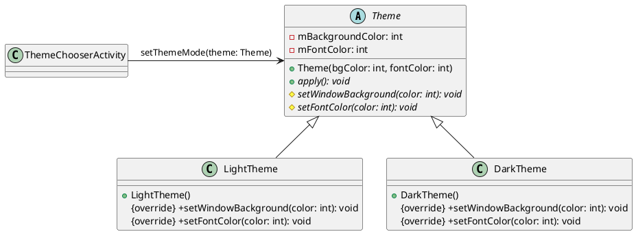

# 模板方法模式Android

以下是一个使用模板方法模式的 Android 示例程序，实现了两个不同的APP主题皮肤选择功能。



1. ThemeChooserActivity.java

```java
public class ThemeChooserActivity extends AppCompatActivity {
    private RadioGroup mRadioGroup;
    private Button mConfirmButton;

    @Override
    protected void onCreate(Bundle savedInstanceState) {
        super.onCreate(savedInstanceState);
        setContentView(R.layout.activity_theme_chooser);

        mRadioGroup = (RadioGroup) findViewById(R.id.rg_themes);
        mConfirmButton = (Button) findViewById(R.id.btn_confirm);

        mConfirmButton.setOnClickListener(new View.OnClickListener() {
            @Override
            public void onClick(View v) {
                int selectedId = mRadioGroup.getCheckedRadioButtonId();
                switch (selectedId) {
                    case R.id.rb_theme_light:
                        setThemeMode(new LightTheme());
                        break;
                    case R.id.rb_theme_dark:
                        setThemeMode(new DarkTheme());
                        break;
                }
            }
        });
    }

    private void setThemeMode(Theme theme) {
        theme.apply();
        Intent intent = new Intent(this, MainActivity.class);
        startActivity(intent);
        finish();
    }
}
```

2. Theme.java

```java
public abstract class Theme {
    protected int mBackgroundColor;
    protected int mFontColor;

    public Theme(int bgColor, int fontColor) {
        this.mBackgroundColor = bgColor;
        this.mFontColor = fontColor;
    }

    public final void apply() {
        setWindowBackground(mBackgroundColor);
        setFontColor(mFontColor);
    }

    protected abstract void setWindowBackground(int color);

    protected abstract void setFontColor(int color);
}
```

3. LightTheme.java

```java
public class LightTheme extends Theme {
    public LightTheme() {
        super(Color.WHITE, Color.BLACK);
    }

    @Override
    protected void setWindowBackground(int color) {
        ThemeChooserActivity.this.getWindow().getDecorView().setBackgroundColor(color);
    }

    @Override
    protected void setFontColor(int color) {
        mRadioGroup.setBackgroundColor(color);
        mConfirmButton.setTextColor(color);
    }
}
```

4. DarkTheme.java

```java
public class DarkTheme extends Theme {
    public DarkTheme() {
        super(Color.BLACK, Color.WHITE);
    }

    @Override
    protected void setWindowBackground(int color) {
        ThemeChooserActivity.this.getWindow().getDecorView().setBackgroundColor(color);
    }

    @Override
    protected void setFontColor(int color) {
        mRadioGroup.setBackgroundColor(color);
        mConfirmButton.setTextColor(color);
    }
}
```

在上述代码中，我们通过定义一个抽象类 `Theme` 表示不同的主题样式，其中包含两个基本方法 `setWindowBackground()` 和 `setFontColor()`，它们被模板方法 `apply()` 调用。`LightTheme` 和 `DarkTheme` 是具体子类，分别继承了 `Theme` 类并实现了它们各自的样式。

最后，在 `ThemeChooserActivity` 中，我们使用 `RadioGroup` 来让用户选择主题样式，并根据用户的选择来设置对应的主题，从而切换到不同的 APP 主题皮肤。其对应的布局文件和字符串资源可以根据自己需要进行设计改变。