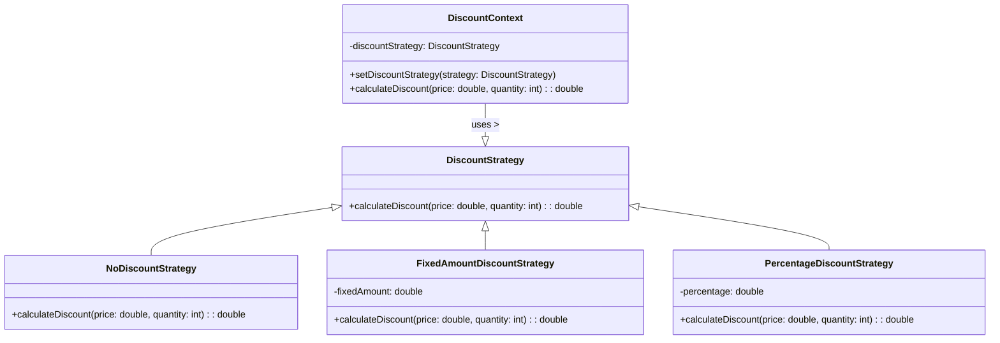

# 策略模式

策略模式（Strategy Pattern）是一种**行为型设计模式**，它允许我们定义一系列算法，并将每个算法封装起来使其可以相互替换。通过这种方式，不同的算法实现可以在运行时动态地选择和切换，从而满足不同的业务需求。

策略模式的核心思想是分离算法的实现和调用方的代码。通常情况下，我们会：
1. 定义一个接口或抽象类作为算法实现的公共接口。
2. 在不同的具体实现中分别实现不同的算法逻辑。
3. 在调用方的代码中，可以根据具体场景动态地选择和使用不同的算法实现，从而实现更加智能化的业务处理。

策略模式具有如下优缺点：

优点：
- 算法实现与调用方解耦，便于维护和扩展。
- 可以在运行时动态选择和切换不同的算法实现，提高了系统的灵活性和可扩展性。
- 符合开闭原则，新增算法实现无需修改调用方的代码。

缺点：
- 增加了系统复杂度，需要设计和维护多个算法实现和调用接口。
- 需要客户端自行管理算法实现的选择和切换。

策略模式在实际开发中可以被广泛应用，例如商城系统的折扣策略、游戏中不同的移动方式等。

## 示例：不同的折扣策略



场景：假设我们正在开发一个商城系统，该系统需要实现不同类型的折扣策略。其中，每种折扣策略都可以看作一种具体的算法，而在结算时，系统会根据某些条件（如用户等级、商品数量等）来动态选择相应的折扣策略。

```java
// 折扣策略接口
interface DiscountStrategy {
    double calculateDiscount(double price, int quantity);
}

// 无折扣策略
class NoDiscountStrategy implements DiscountStrategy {
    public double calculateDiscount(double price, int quantity) {
        return 0;
    }
}

// 固定金额折扣策略
class FixedAmountDiscountStrategy implements DiscountStrategy {
    private double fixedAmount;

    public FixedAmountDiscountStrategy(double fixedAmount) {
        this.fixedAmount = fixedAmount;
    }

    public double calculateDiscount(double price, int quantity) {
        return Math.max(0, fixedAmount * quantity);
    }
}

// 百分比折扣策略
class PercentageDiscountStrategy implements DiscountStrategy {
    private double percentage;

    public PercentageDiscountStrategy(double percentage) {
        this.percentage = percentage;
    }

    public double calculateDiscount(double price, int quantity) {
        return Math.max(0, price * percentage * quantity);
    }
}

// 折扣策略上下文类
class DiscountContext {
    private DiscountStrategy discountStrategy;

    public void setDiscountStrategy(DiscountStrategy discountStrategy) {
        this.discountStrategy = discountStrategy;
    }

    public double calculateDiscount(double price, int quantity) {
        return discountStrategy.calculateDiscount(price, quantity);
    }
}
```

在上述示例代码中，我们首先定义了一个DiscountStrategy接口，和三个具体的折扣策略类NoDiscountStrategy、FixedAmountDiscountStrategy和PercentageDiscountStrategy。这些类都实现了DiscountStrategy接口，并分别根据自己的算法实现了calculateDiscount方法。

在DiscountContext类中，我们通过setDiscountStrategy方法来设置不同的折扣策略，在结算时调用其calculateDiscount方法即可动态选择相应的折扣策略。

为了更好地理解以上示例代码，以下是一个简单的测试Demo：

```java
public class StrategyDemo {
    public static void main(String[] args) {
        // 初始化
        DiscountContext context = new DiscountContext();
        context.setDiscountStrategy(new NoDiscountStrategy());

        // 计算无折扣价格
        double price1 = 100;
        int quantity1 = 2;
        System.out.println("无折扣： " + context.calculateDiscount(price1, quantity1));

        // 计算固定金额折扣价格
        double price2 = 80;
        int quantity2 = 3;
        context.setDiscountStrategy(new FixedAmountDiscountStrategy(10));
        System.out.println("固定金额折扣： " + context.calculateDiscount(price2, quantity2));

        // 计算百分比折扣价格
        double price3 = 60;
        int quantity3 = 4;
        context.setDiscountStrategy(new PercentageDiscountStrategy(0.1));
        System.out.println("百分比折扣： " + context.calculateDiscount(price3, quantity3));
    }
}
```

在以上测试Demo中，我们首先初始化DiscountContext类，并通过setDiscountStrategy方法设置默认的无折扣策略。接着，我们分别计算了三种不同的商品结算价格，从而验证了策略模式的实现。

需要注意的是，在实际开发中，我们可以根据具体需求设计不同类型的折扣策略，同时还可以动态切换不同的折扣策略来满足不同的商业需求。

## 示例：不同的加密策略

演示了如何在Android应用中使用策略模式来处理不同的加密方式：

首先，在Android项目中定义一个名为`IEncryptStrategy`的接口，用于声明不同加密方式的公共方法：

```java
public interface IEncryptStrategy {
    String encrypt(String data);
}
```

然后，我们可以为不同类型的加密方式实现具体的加密策略。例如，对于AES加密方式，我们可以定义一个`AESEncryptStrategy`类，其中实现了对数据的AES加密：

```java
public class AESEncryptStrategy implements IEncryptStrategy {
    @Override
    public String encrypt(String data) {
        // 实现AES加密逻辑
        return "AES encrypted: " + data;
    }
}
```

类似地，我们还可以为其他类型的加密方式（如DES、RSA等）分别实现相应的加密策略。

最后，在业务逻辑中，我们可以根据具体场景动态地选择和使用不同的加密策略。例如，以下代码演示了如何在Android应用中使用策略模式来处理数据的加解密操作：

```java
public class DataEncryptor {
    private IEncryptStrategy encryptStrategy;

    // 在初始化时设置默认的加密方式
    public DataEncryptor() {
        encryptStrategy = new AESEncryptStrategy();
    }

    // 切换到DES加密方式
    public void switchToDESEncryptor() {
        encryptStrategy = new DESEncryptStrategy();
    }

    // 切换到RSA加密方式
    public void switchToRSAEncryptor() {
        encryptStrategy = new RSAEncryptStrategy();
    }

    // 对数据进行加密操作
    public String encryptData(String data) {
        return encryptStrategy.encrypt(data);
    }
}
```

通过上述代码示例，我们可以看到如何在Android应用中使用策略模式来管理不同的加密方式，并根据具体情况选择和使用不同的加密策略。这种设计方式可以提高代码复用性和灵活性，便于扩展和修改应用逻辑。

## 示例：不同的排序算法

演示了如何在Android应用中使用策略模式来处理不同的排序算法：

首先，在Android项目中定义一个名为`ISortStrategy`的接口，用于声明不同排序算法的公共方法：

```java
public interface ISortStrategy {
    void sort(int[] arr);
}
```

然后，我们可以为不同类型的排序算法实现具体的排序策略。例如，对于快速排序算法，我们可以定义一个`QuickSortStrategy`类，其中实现了对整型数组的快速排序：

```java
public class QuickSortStrategy implements ISortStrategy {
    @Override
    public void sort(int[] arr) {
        // 实现快速排序算法
        Arrays.sort(arr);
    }
}
```

类似地，我们还可以为其他类型的排序算法（如冒泡排序、堆排序等）分别实现相应的排序策略。

最后，在业务逻辑中，我们可以根据具体场景动态地选择和使用不同的排序策略。例如，以下代码演示了如何在Android应用中使用策略模式来处理整型数组的排序操作：

```java
public class ArraySorter {
    private ISortStrategy sortStrategy;

    // 在初始化时设置默认的排序方式
    public ArraySorter() {
        sortStrategy = new QuickSortStrategy();
    }

    // 切换到冒泡排序方式
    public void switchToBubbleSort() {
        sortStrategy = new BubbleSortStrategy();
    }

    // 切换到堆排序方式
    public void switchToHeapSort() {
        sortStrategy = new HeapSortStrategy();
    }

    // 对整型数组进行排序操作
    public void sortArray(int[] arr) {
        sortStrategy.sort(arr);
    }
}
```

通过上述代码示例，我们可以看到如何在Android应用中使用策略模式来管理不同的排序算法，并根据具体情况选择和使用不同的排序策略。这种设计方式可以提高代码复用性和灵活性，便于扩展和修改应用逻辑。