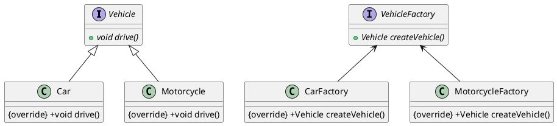
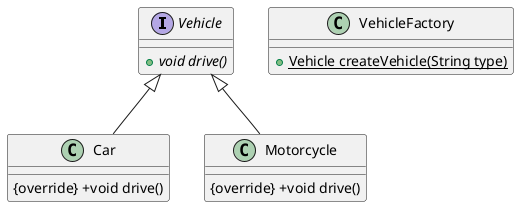

#  简单工厂Java

## 示例（抽象工厂实现）

以下是一个简单的 Java 实现的抽象工厂模式示例，该示例创建汽车和摩托车两个产品系列，并为每个产品系列定义了具体的工厂类和产品类：



1. 定义抽象产品类

```java
public interface Vehicle {
    void drive();
}
```

2. 定义具体产品类

```java
public class Car implements Vehicle {
    @Override
    public void drive() {
        System.out.println("Driving a car");
    }
}
```

```java
public class Motorcycle implements Vehicle {
    @Override
    public void drive() {
        System.out.println("Riding a motorcycle");
    }
}
```

3. 定义抽象工厂类

```java
public interface VehicleFactory {
    Vehicle createVehicle();
}
```

4. 定义具体工厂类

```java
public class CarFactory implements VehicleFactory {
    @Override
    public Vehicle createVehicle() {
        return new Car();
    }
}
```

```java
public class MotorcycleFactory implements VehicleFactory {
    @Override
    public Vehicle createVehicle() {
        return new Motorcycle();
    }
}
```

5. 测试代码

```java
public class Main {
    public static void main(String[] args) {
        // 创建汽车工厂并生产汽车
        VehicleFactory carFactory = new CarFactory();
        Vehicle car = carFactory.createVehicle();
        car.drive();

        // 创建摩托车工厂并生产摩托车
        VehicleFactory motorcycleFactory = new MotorcycleFactory();
        Vehicle motorcycle = motorcycleFactory.createVehicle();
        motorcycle.drive();
    }
}
```

## 示例（简单工厂实现）

以下是使用简单工厂模式实现的代码示例:



1. 定义抽象产品类

```java
public interface Vehicle {
    void drive();
}
```

2. 定义具体产品类

```java
public class Car implements Vehicle {
    @Override
    public void drive() {
        System.out.println("Driving a car");
    }
}
```

```java
public class Motorcycle implements Vehicle {
    @Override
    public void drive() {
        System.out.println("Riding a motorcycle");
    }
}
```

3. 定义简单工厂类

```java
public class VehicleFactory {
    public static Vehicle createVehicle(String type) {
        if(type.equalsIgnoreCase("car")) {
            return new Car();
        } else if(type.equalsIgnoreCase("motorcycle")) {
            return new Motorcycle();
        } else {
            return null;
        }
    }
}
```

4. 测试代码

```java
public class Main {
    public static void main(String[] args) {
        // 生产汽车
        Vehicle car = VehicleFactory.createVehicle("car");
        car.drive();

        // 生产摩托车
        Vehicle motorcycle = VehicleFactory.createVehicle("motorcycle");
        motorcycle.drive();
    }
}
```

在上述示例中，我们使用简单工厂模式创建了汽车和摩托车两个不同的产品，通过 `VehicleFactory` 的静态方法 `createVehicle()` 来创建对应的具体产品，然后调用其方法。

## 简单工厂和抽象工厂的区别

简单工厂模式和抽象工厂模式都是属于创建型设计模式，它们的主要区别在于适用场景和实现方式。

| 特点 | 简单工厂模式       | 抽象工厂模式             |
| ---- | ------------------ | ------------------------ |
| 适用场景 | 生产单一产品        | 生产多个产品系列         |
| 对象数量 | 创建对象较少        | 创建对象较多             |
| 实现方式 | 单一的工厂类决定产品类型 | 每个产品系列有一个具体工厂接口和一组具体产品类 |
| 灵活性   | 不够灵活，无法满足复杂需求 | 具有良好的扩展性和灵活性 |
| 修改代码 | 较为容易           | 增加新产品系列时需要修改代码       |

简单工厂模式适用于需要生产单一产品的情况，即创建的对象数量较少且不会频繁地变化。简单工厂通常由一个工厂类来决定要建立哪一种产品对象，而客户端只需要传入对应产品的参数即可。简单工厂模式具有易于实现的优点，但缺点是不够灵活，无法满足复杂的产品生产需求。

抽象工厂模式适用于需要生产多个产品系列的情况，即每个系列包含多个具体产品，使得不同的产品之间存在着一定的关联或约束关系。抽象工厂模式通过为每个产品系列提供一个工厂接口以及针对该产品系列的一组具体产品类来实现创建对象。抽象工厂模式具有良好的扩展性和灵活性，允许在不修改代码的情况下增加新产品系列，但缺点也是比较明显的：随着产品系列的增加，该模式所需要的代码量将会增加，并且每次增加新的产品系列时都需要修改代码。

因此，简单工厂模式适用于相对简单的产品结构和用户需求不经常变化的情况，而抽象工厂模式适合复杂的产品结构和用户需求经常变化的情况。