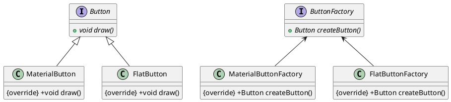
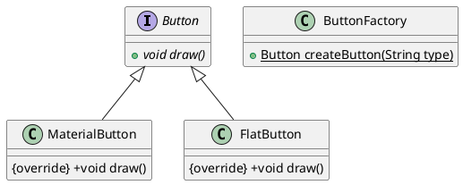

#  简单工厂Android

## 示例（抽象工厂实现）

以下是一个简单的 Android 实现的抽象工厂模式示例，该示例创建两个不同的 Button 类型以及对应的工厂类：



1. 定义抽象产品类

```java
public interface Button {
    void draw();
}
```

2. 定义具体产品类

```java
public class MaterialButton implements Button {
    @Override
    public void draw() {
        System.out.println("Drawing a material button");
    }
}
```

```java
public class FlatButton implements Button {
    @Override
    public void draw() {
        System.out.println("Drawing a flat button");
    }
}
```

3. 定义抽象工厂类

```java
public interface ButtonFactory {
    Button createButton();
}
```

4. 定义具体工厂类

```java
public class MaterialButtonFactory implements ButtonFactory {
    @Override
    public Button createButton() {
        return new MaterialButton();
    }
}
```

```java
public class FlatButtonFactory implements ButtonFactory {
    @Override
    public Button createButton() {
        return new FlatButton();
    }
}
```

5. 测试代码

```java
ButtonFactory materialButtonFactory = new MaterialButtonFactory();
Button materialButton = materialButtonFactory.createButton();
materialButton.draw();

ButtonFactory flatButtonFactory = new FlatButtonFactory();
Button flatButton = flatButtonFactory.createButton();
flatButton.draw();
```

## 示例（简单工厂实现）
以下是使用简单工厂模式实现的代码示例:



1. 定义抽象产品类

```java
public interface Button {
    void draw();
}
```

2. 定义具体产品类

```java
public class MaterialButton implements Button {
    @Override
    public void draw() {
        System.out.println("Drawing a material button");
    }
}
```

```java
public class FlatButton implements Button {
    @Override
    public void draw() {
        System.out.println("Drawing a flat button");
    }
}
```

3. 定义简单工厂类

```java
public class ButtonFactory {
    public static Button createButton(String type) {
        if (type.equalsIgnoreCase("material")) {
            return new MaterialButton();
        } else if (type.equalsIgnoreCase("flat")) {
            return new FlatButton();
        } else {
            return null;
        }
    }
}
```

4. 测试代码

```java
Button materialButton = ButtonFactory.createButton("material");
materialButton.draw();

Button flatButton = ButtonFactory.createButton("flat");
flatButton.draw();
```