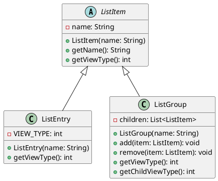

# 组合模式Android

下面是一个使用Android实现组合模式的简单demo示例。这个demo使用组合模式来表示一个多级列表，其中列表项和分组都是包含多个子节点的组合节点。



首先定义抽象组件类`ListItem`，它定义了所有列表元素（包括叶子节点和组合节点）的通用接口：

```java
public abstract class ListItem {
    protected String name;

    public ListItem(String name) {
        this.name = name;
    }

    public String getName() {
        return name;
    }

    public abstract int getViewType();
}
```

叶子节点`ListEntry`表示列表中的单个项，它继承自`ListItem`并实现了`getViewType`方法。组合节点`ListGroup`表示列表中的分组，它可以包含多个子节点（既可以是叶子节点也可以是组合节点），并实现了`add`、`remove`、`getViewType`和`getChildViewType`方法。

下面是具体实现的代码：

```java
// 叶子节点：列表项
public class ListEntry extends ListItem {
    public static final int VIEW_TYPE = 0;

    public ListEntry(String name) {
        super(name);
    }

    @Override
    public int getViewType() {
        return VIEW_TYPE;
    }
}

// 组合节点：分组
public class ListGroup extends ListItem {
    private List<ListItem> children = new ArrayList<>();

    public ListGroup(String name) {
        super(name);
    }

    public void add(ListItem item) {
        children.add(item);
    }

    public void remove(ListItem item) {
        children.remove(item);
    }

    @Override
    public int getViewType() {
        return getChildViewType();
    }

    public int getChildViewType() {
        // 递归获取子节点中的最小视图类型
        int minChildViewType = Integer.MAX_VALUE;
        for (ListItem child : children) {
            int viewType = child.getViewType();
            if (viewType < minChildViewType) {
                minChildViewType = viewType;
            }
            if (child instanceof ListGroup) {
                int childViewType = ((ListGroup) child).getChildViewType();
                if (childViewType < minChildViewType) {
                    minChildViewType = childViewType;
                }
            }
        }
        return minChildViewType;
    }
}
```

然后，我们创建一个简单的多级列表，它包含两个组合节点和两个叶子节点。在`ListActivity`的`onCreate`方法里初始化列表，并使用`RecyclerView`来显示这个列表。

```java
public class ListActivity extends AppCompatActivity {
    private RecyclerView recyclerView;

    @Override
    protected void onCreate(Bundle savedInstanceState) {
        super.onCreate(savedInstanceState);
        setContentView(R.layout.activity_list);

        // 初始化列表数据
        ListGroup group1 = new ListGroup("Group 1");
        ListEntry entry1 = new ListEntry("Entry 1");
        ListEntry entry2 = new ListEntry("Entry 2");
        group1.add(entry1);
        group1.add(entry2);

        ListGroup group2 = new ListGroup("Group 2");
        ListEntry entry3 = new ListEntry("Entry 3");
        ListEntry entry4 = new ListEntry("Entry 4");
        group2.add(entry3);
        group2.add(entry4);

        ListGroup root = new ListGroup("Root");
        root.add(group1);
        root.add(group2);

        // 初始化RecyclerView
        recyclerView = findViewById(R.id.recycler_view);
        recyclerView.setLayoutManager(new LinearLayoutManager(this));

        ListAdapter adapter = new ListAdapter(root);
        recyclerView.setAdapter(adapter);
    }

    private class ListAdapter extends RecyclerView.Adapter<RecyclerView.ViewHolder> {
        private ListItem root;

        public ListAdapter(ListItem root) {
            this.root = root;
        }

        @NonNull
        @Override
        public RecyclerView.ViewHolder onCreateViewHolder(@NonNull ViewGroup parent, int viewType) {
            switch (viewType) {
                case ListEntry.VIEW_TYPE:
                    View entryView = LayoutInflater.from(parent.getContext())
                            .inflate(android.R.layout.simple_list_item_1, parent, false);
                    return new EntryViewHolder(entryView);
                default:
                    View groupView = LayoutInflater.from(parent.getContext())
                            .inflate(android.R.layout.simple_expandable_list_item_1, parent, false);
                    return new GroupViewHolder(groupView);
            }
        }

        @Override
        public void onBindViewHolder(@NonNull RecyclerView.ViewHolder holder, int position) {
            if (holder instanceof EntryViewHolder) {
                ListEntryentry = (ListEntry) getItem(position);
                ((EntryViewHolder) holder).bind(entry);
            } else if (holder instanceof GroupViewHolder) {
                ListGroup group = (ListGroup) getItem(position);
                ((GroupViewHolder) holder).bind(group);
            }
        }

        @Override
        public int getItemCount() {
            return root instanceof ListEntry ? 1 : ((ListGroup) root).getChildCount();
        }

        @Override
        public int getItemViewType(int position) {
            ListItem item = getItem(position);
            return item.getViewType();
        }

        private ListItem getItem(int position) {
            if (root instanceof ListEntry) {
                return root;
            } else {
                int childPosition = position;
                for (ListItem child : ((ListGroup) root).getChildren()) {
                    if (child instanceof ListGroup) {
                        int childCount = ((ListGroup) child).getChildCount();
                        if (childPosition < childCount) {
                            return getItem(child, childPosition);
                        } else {
                            childPosition -= childCount;
                        }
                    } else {
                        if (childPosition == 0) {
                            return child;
                        } else {
                            childPosition--;
                        }
                    }
                }
                throw new IndexOutOfBoundsException("Invalid position: " + position);
            }
        }

        private ListItem getItem(ListGroup group, int position) {
            int childPosition = position;
            for (ListItem child : group.getChildren()) {
                if (child instanceof ListGroup) {
                    int childCount = ((ListGroup) child).getChildCount();
                    if (childPosition < childCount) {
                        return getItem((ListGroup) child, childPosition);
                    } else {
                        childPosition -= childCount;
                    }
                } else {
                    if (childPosition == 0) {
                        return child;
                    } else {
                        childPosition--;
                    }
                }
            }
            throw new IndexOutOfBoundsException("Invalid position: " + position);
        }

        private class EntryViewHolder extends RecyclerView.ViewHolder {
            private TextView textView;

            public EntryViewHolder(@NonNull View itemView) {
                super(itemView);
                textView = itemView.findViewById(android.R.id.text1);
            }

            public void bind(ListEntry entry) {
                textView.setText(entry.getName());
            }
        }

        private class GroupViewHolder extends RecyclerView.ViewHolder {
            private TextView textView;

            public GroupViewHolder(@NonNull View itemView) {
                super(itemView);
                textView = itemView.findViewById(android.R.id.text1);
            }

            public void bind(ListGroup group) {
                textView.setText(group.getName());
            }
        }
    }
}
```

当运行程序时，将会看到一个多级列表，里面包含两个分组和四个项：

```
Root
- Group 1
  - Entry 1
  - Entry 2
- Group 2
  - Entry 3
  - Entry 4
```

上述示例展示了如何使用组合模式来构建一个复杂的Android UI元素。通过组合模式，我们可以方便地组织复杂的UI结构，并递归地调用子元素的方法来显示整个UI界面。在这个例子中，我们使用了`RecyclerView`来实现列表的显示，并根据不同的视图类型来选择不同的布局。