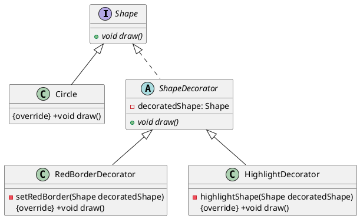

# 装饰器模式Java

以下是一个简单的 Java 实现的装饰器模式示例，该示例创建了两个不同的装饰器来增加 `Shape` 对象的功能：



1. 定义抽象基类

```java
public interface Shape {
    void draw();
}
```

2. 定义具体基类

```java
public class Circle implements Shape {
    @Override
    public void draw() {
        System.out.println("Drawing a circle");
    }
}
```

3. 定义装饰器抽象类

```java
public abstract class ShapeDecorator implements Shape {
    protected Shape decoratedShape;

    public ShapeDecorator(Shape decoratedShape) {
        this.decoratedShape = decoratedShape;
    }

    public void draw() {
        decoratedShape.draw();
    }
}
```

4. 定义具体装饰器类

```java
public class RedBorderDecorator extends ShapeDecorator {
    public RedBorderDecorator(Shape decoratedShape) {
        super(decoratedShape);
    }

    public void draw() {
        decoratedShape.draw();
        setRedBorder(decoratedShape);
    }

    private void setRedBorder(Shape decoratedShape){
        System.out.println("Setting red border for the shape");
    }
}
```

```java
public class HighlightDecorator extends ShapeDecorator {
    public HighlightDecorator(Shape decoratedShape) {
        super(decoratedShape);
    }

    public void draw() {
        decoratedShape.draw();
        highlightShape(decoratedShape);
    }

    private void highlightShape(Shape decoratedShape){
        System.out.println("Highlighting the shape");
    }
}
```

5. 测试代码

```java
Shape circle = new Circle();
circle.draw();

Shape redCircle = new RedBorderDecorator(new Circle());
redCircle.draw();

Shape highlightedRedCircle = new HighlightDecorator(new RedBorderDecorator(new Circle()));
highlightedRedCircle.draw();
```

在上述示例中，我们使用装饰器模式创建了两个不同的装饰器：`RedBorderDecorator` 和 `HighlightDecorator`，这两个装饰器分别为 `Shape` 对象增加了红色边框和高亮效果。我们通过`Circle`类定义了一个圆形基类，并通过组合方式来让装饰器对象持有需要被装饰的 `Shape` 对象。最后，在测试代码中分别为原始的圆形、带红色边框的圆形和带红色边框且高亮的圆形调用 `draw()` 方法。